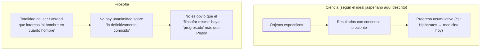
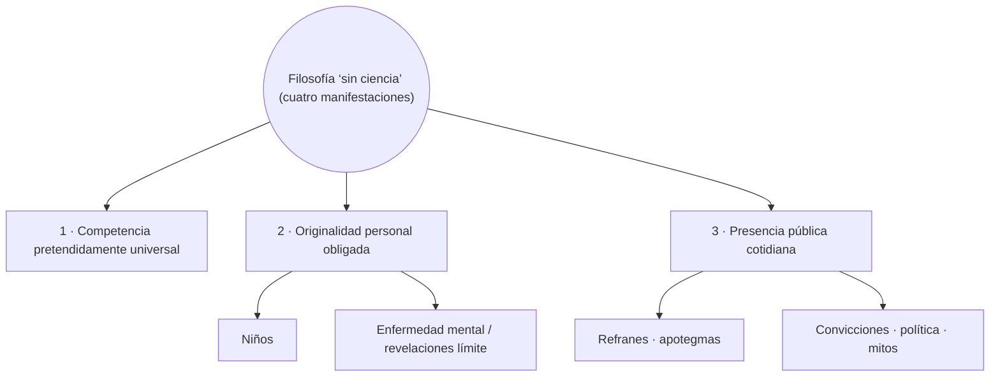
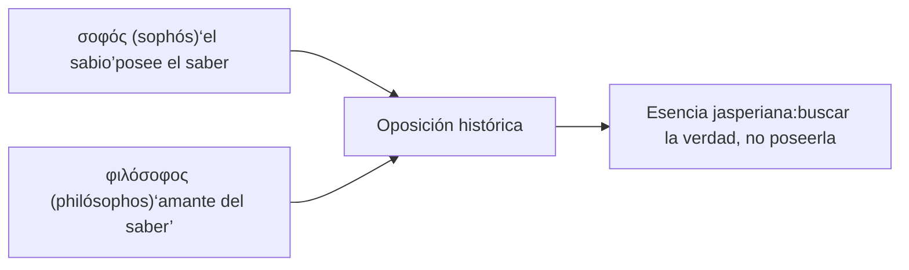
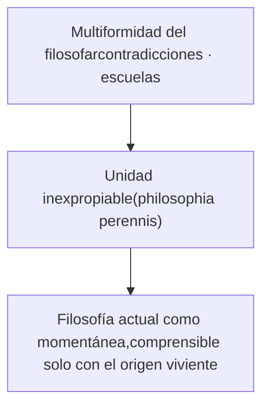
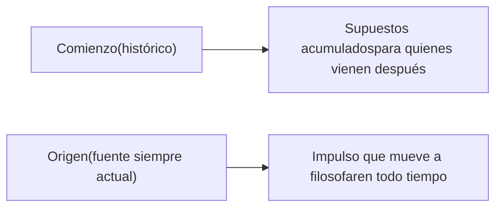
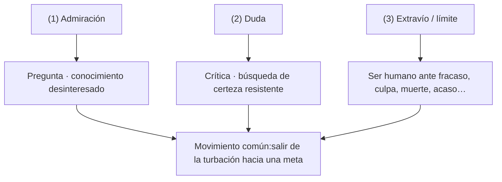
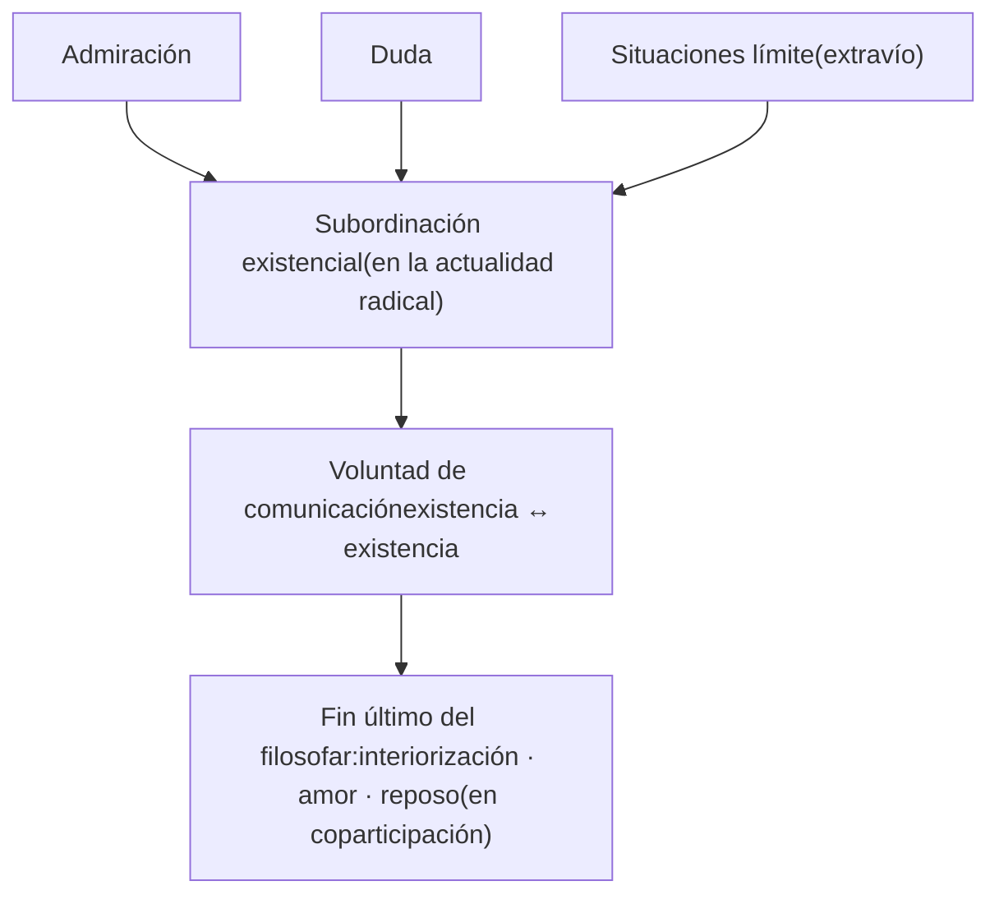

# Karl Jaspers — **La filosofía desde el punto de vista de la existencia**

> **Nota editorial (edición digital):** el título alemán original es *Einführung in die Philosophie* (“Introducción a la filosofía”). El título en español que usamos acá es el de la edición común (trad. José Gaos, 1953).

## Guía de lectura

Este documento condensa de modo **exhaustivo** los **Capítulos I y II** del libro: *“¿Qué es la filosofía?”* y *“Los orígenes de la filosofía”*. La exposición sigue el orden de Jaspers, explicita sus tesis y distinciones, y añade diagramas **Mermaid** para orientar el estudio.

---

## Parte A — Capítulo I: “¿Qué es la filosofía?”

### A.1. Tesis inicial: la filosofía es siempre objeto de juicios encontrados

Jaspers parte de un hecho sociológico-espiritual innegable: bajo el nombre de “filosofía” conviven **apreciaciones opuestas**. Algunas caricaturas típicas:

| Se la presenta como… | O como… |
|---|---|
| Revelación extraordinaria | Pensamiento sin objeto real |
| Quehacer serio de personajes raros | Cavilar superfluo de soñadores |
| Asunto que “debería ser simple” | Disciplina imposible que desespera |

Lo notable es que **ambos conjuntos de juicios encuentran “ejemplos justificativos”** en lo que históricamente se ha llamado filosofía.

---

### A.2. Filosofía y ciencia: tres diferencias que Jaspers insiste en no trivializar

**2.1. Falta de resultados universalmente válidos “posesionables”.**  
Para quien deposita fe en la ciencia, puede ser **lo peor** de la filosofía que, pese a milenios de esfuerzo, no exhiba un cuerpo de verdades como las de la física o la matemática. Jaspers formula sin ambages: **en filosofía no hay unanimidad sobre lo conocido definitivamente**. Y añade una observación clave: lo que llega a ser **aceptado por todos con razones “imperiosas”** tiende a **salir del ámbito filosófico** y a instalarse como **conocimiento científico especializado**.

**2.2. Ausencia de un progreso lineal comparable al de las ciencias.**  
El contraste paradigmático es médico: *estamos muy por delante de Hipócrates; **difícilmente podemos decir lo mismo respecto de Platón*** en el **filosofar mismo** (más allá del material científico disponible para un autor antiguo). Jaspers sugiere que la filosofía **quizá apenas ha vuelto a alcanzar** ese nivel de encuentro originario.

**2.3. Tipo de certeza distinto.**  
La certeza filosófica **no es** la certeza científica “idéntica para todo intelecto”. Entra en juego, según Jaspers, **“la esencia entera del hombre”**. Mientras las ciencias versan sobre **objetos particulares** cuyo dominio no exige todo ser humano, en filosofía se trata a menudo de la **totalidad del ser** y de una verdad que, cuando “destella”, **hiere más hondo** que el saber científico.

---

### A.3. Vinculación con la ciencia… y otro “origen del espíritu filosófico”

La filosofía **bien trabajada** asume el estado **más avanzado** de las ciencias de su época; pero **el espíritu** de la filosofía tiene **otro nacimiento**: **brote donde despiertan los hombres, antes y más allá de toda ciencia**.

Jaspers propone **imaginar la filosofía sin ciencia** en cuatro manifestaciones (no exhaustivas, pero ilustrativas):

#### (1) “Casi todo el mundo se tiene por competente”

En ciencia se admite formación, método, estudio; frente a filosofía muchos creen bastar **humanidad + destino + experiencia propia**. Jaspers **acepta la exigencia de accesibilidad**: los caminos prolijos de los profesionales solo tienen sentido si **desembocan en el hombre**, caracterizado por su modo de saber del ser y de sí en el ser.

#### (2) El filosofar debe ser original; cada quien lo ha de realizar

La prueba "maravillosa" son las **preguntas infantiles**, que a veces **penetran la profundidad del filosofar**:

| Ejemplo (síntesis jasperiana) | Núcleo filosófico tocado |
|---|---|
| “Me empeño en pensar que soy otro y sigo siendo yo” | El enigma del yo y la conciencia del ser en la conciencia del yo |
| “¿Qué había antes del principio?” | Infinitud de la cadena interrogativa; imposibilidad de “alto” concluyente |
| El cuento de elfos vs. el “movimiento” del sol/tierra; “solo creo lo que veo” → el choque con Dios invisible | Diferencia entre pregunta por objetos del mundo y pregunta por el **ser** y **nuestra existencia** |
| La niña ante el paseo: todo pasa; exige “algo fijo” | Pasmo ante caducidad universal; búsqueda de permanencia |

Jaspers advierte: las objeciones (“lo oyó de adultos”; “no continuó filosofando”) **no licúan** la seriedad de tales pensamientos. Su tesis fuerte: muchos niños tienen **genialidad que se pierde al crecer**, como si la madurez fuese **prisión de convenciones** que oculta lo cuestionable.

#### (3) Enfermos mentales; el umbral de lo Velado

A veces, en ciertos trastornos o al despertar, aparecen “revelaciones” metafísicas **estremecedoras** que, por su forma, no alcanzan estatus “objetivo” (salvo casos excepcionales de creadores). Quien las presencia siente **romperse un velo** del vivir ordinario. Jaspers cita la intuición de que **“niños y locos dicen la verdad”**, pero recoloca la **originalidad creadora** de la filosofía en **grandes espíritus** dispersos en la historia.

#### (4) Filosofía siempre presente: mitos, lenguaje, política

La filosofía, **siempre ahí**: refranes, apotegmas, mitos, ideas políticas, lenguaje ilustrado. **No hay escapar a la filosofía**; la cuestión es si será **consciente** o no, **buena** o **mala**, **clara** o **confusa**. Negar la filosofía también es **profesar una filosofía inconsciente**.

---

### A.4. Definición por el griego: *philósophos* frente a *sophós*

- **Filosofía = ir de camino** (preguntas más esenciales que respuestas; cada respuesta abre nueva pregunta).
- El **dogmatismo** traiciona esto al convertir el filosofar en **saber enunciado, perfecto, enseñable**.
- En ese “ir de camino” cabe, no obstante, **plenitud en momentos fuertes**: no como **certeza enunciable**, sino como **realización histórica del ser del hombre** al que se le abre el ser.

Jaspers subraya: **no hay definición superior externa**. *“Qué sea la filosofía hay que intentarlo”*. Es a la vez **actividad viva del pensamiento** y **reflexión sobre ese pensamiento**; solo desde el intento propio se percibe lo que “hace frente” como filosofía.

---

### A5. Fórmulas históricas (sin agotar el sentido)

**Antigüedad (muestra):**

- Conocimiento de lo divino y lo humano.
- Conocimiento del ente en cuanto ente.
- Fin: aprender a morir; alcanzar felicidad; asimilación a lo divino.
- Como saber universal: el **saber de todo saber**, arte de artes, “ciencia” no acotada.

**“Hoy” (fórmulas posibles en el texto):**

1. Ver la realidad en su **origen**.  
2. Aprehender la realidad **conversando consigo mismo** en actividad interior.  
3. **Abrirse** a la vastedad de lo circundante.  
4. **Osar** la comunicación de hombre a hombre, con espíritu de verdad, en **lucha amorosa**.  
5. Mantener **despierta la razón** ante lo extraño y lo que se resiste.

**Síntesis jasperiana:** la filosofía es la **concentración** mediante la cual el hombre **llega a ser él mismo** haciéndose **partícipe de la realidad**.

---

### A.6. Justificación imposible, comunicación posible; ataques históricos

**La filosofía no se justifica como instrumento** de algo mayor. Solo puede **volverse** hacia las **fuerzas** que realmente impulsan a filosofar: un impulso **tan desinteresado** que prescinde de utilidad/nocividad mundanas y **se realizará mientras haya hombres**.

Incluso sistemas hostiles (ejemplos del texto: **marxismo y fascismo**) terminan siendo **sustitutos** de filosofía bajo lógica de **efecto buscado**, lo que **atestigua** la imposibilidad de eludir del todo el filosofar.

**Tres grandes líneas de rechazo:**

| Fuente del rechazo | Crítica típica que menciona Jaspers |
|---|---|
| Autoritarismo eclesiástico | Aleja de Dios, corrompe el alma, “nada” |
| Totalitarismo político | Solo se interpreta el mundo; hay que transformarlo; filosofía destruye orden y fomenta independencia |
| Sentido común utilitarista | “No sirve”; anécdota de **Tales** y la sirvienta (cielo vs. pozo) |

Actitud jasperiana: la filosofía **no lucha ni se prueba**, pero **puede comunicarse**: no fuerza resistencias ni se jacta ante el acogimiento. Vive en una “atmósfera” de **unidad profunda posible** entre humanos.

---

### A.7. Tradición, multiplicidad y *philosophia perennis*

Hay **dos mil quinientos años** de filosofía sistemática (Occidente, China, India). Las contradicciones y las “verdades excluyentes” no impiden, para Jaspers, que en el fondo opere una **Unidad** que **nadie posee** pero **ordena todos los esfuerzos serios**: la **filosofía una y eterna** (*philosophia perennis*). Quien quiera pensar esencialmente queda **remitido** a ese fondo histórico.

---

## Parte B — Capítulo II: “Los orígenes de la filosofía”

### B.1. Distinción cardinal: **comienzo** ≠ **origen**

- **Comienzo:** el arranque **histórico** del pensamiento **metódico** (hace ~2500 años) deja **supuestos** que crecen para los sucesores.  
- **Origen:** la **fuente** de la que en **todo tiempo** mana el impulso; lo que hace **esencial** la filosofía **ahora** y permite **comprender** la filosofía **pasada**.

El pensamiento **mítico** es **más antiguo** que el comienzo metódico, pero el capítulo II se centra en el **origen** como impulsos que siguen vivos.

---

### B.2. Triple origen clásico — y cómo se entrelazan

Jaspers articula **tres motivos** fundamentales:

1. **Asombro / admiración → pregunta y conocimiento**  
2. **Duda sobre lo conocido → examen crítico y certeza**  
3. **Conmoción existencial / conciencia de extravío → la cuestión por uno mismo** (especialmente en **situaciones límite**)

#### (1) Admiración (Platón y Aristóteles en el texto)

- Platón: el espectáculo del cielo da el impulso de investigar el universo; de ahí brota la filosofía como **gran don** divino a los mortales.  
- Aristóteles: la admiración impulsa a filosofar; se pasa de lo extraño cercano a lo astronómico y al **origen del universo**.

**Consecuencia existencial:** al admirar, toma conciencia de **no saber**. Se busca saber **no por necesidad común**, sino por satisfacción **en el saber mismo**. El filosofar es un **despertar** respecto de la servidumbre a necesidades inmediatas: se mira **desinteresadamente** el mundo con preguntas cuya respuesta **no “sirve” para nada práctico**.

#### (2) Duda: de la acumulación crítica al punto indubitable

Tras “satisfacer” admiración con conocimientos del **existente**, surge la **duda**:

- Los sentidos parecen **condicionados** y **engañosos** o no concordar con lo “fuera” independiente de la percepción.  
- Las formas mentales **enredan** en contradicciones; proliferan **afirmaciones enfrentadas**.

Dos riesgos: **gozarse en la negación** que ya no respeta nada y no avanza, o **buscar** la certeza que resista crítica honesta.

**Descartes** (*cogito*): incluso el engaño perfecto no puede engañarme sobre mi existencia **mientras pienso al ser engañado**. La duda metódica se convierte en **fuente de examen**; pero lo decisivo es **cómo** y **dónde** desde la duda se **conquista** terreno de certeza.

#### (3) Conciencia de extravío: Epicteto, Epicuro y las **situaciones límite**

Cita a **Epicteto**: el origen de la filosofía es **percibir la propia debilidad e impotencia**.

**Epicuro** (en la línea que expone Jaspers): poner como **indiferente** lo no dependiente de mí; **liberar** por el pensamiento lo interno: **forma y contenido** de mis representaciones.

Pero el núcleo más “existencial” aquí es otro: estar **entregado al conocimiento de objetos**, habiéndose **olvidado de uno mismo**, hasta que **la propia situación** irrumpe.

**Situaciones límite (*Grenzsituationen*):** aquellas de las que **no podemos salir ni alterar** (aunque muten sus apariencias): **morir, padecer, luchar**, estar **sometido al acaso**, **hundirse en la culpa**. En la vida ordinaria se **velan**; al advertirlas, reacción entre **desesperación** y **reconstrucción**; “llegamos a ser nosotros mismos” en **transformación de conciencia**.

**Desconfianza hacia el “ser mundanal”:** la ingenuidad toma el mundo como ser puro; felicidad genera confianza irreflexiva; dolor e impotencia, desesperación; luego, de nuevo, olvido.

- **Dominación técnica y científica** de la naturaleza deja “parcelas” confiables dentro de un todo aún **incalculable** y amenazante (trabajo, vejez, enfermedad, muerte).  
- La sociedad busca seguridad, pero Jaspers niega que **Estado, iglesia o sociedad** protejan **absolutamente**; la “protección total” fue **ilusión** de épocas tranquilas.

A la par, hay **lo digno de fe** en el mundo (hogar, lengua, tradición, personas). Pero **ni siquiera** toda la tradición da **abrigo seguro**: es obra humana, cuestionable; “en ninguna parte del mundo está Dios” (en el sentido de presencia plena objetivable que cierre la duda mundanal).

El gesto jasperiano: la desconfianza mundanal funciona como **índice** que **prohíbe** satisfacción plena **en** el mundo y **señala** algo **distinto** del mundo.

**La experiencia del fracaso:** las situaciones límite enseñan **fracasar**. La forma de experimentar el fracaso (oculto, visto sin velos, tranquilidad ilusoria, aceptación silenciosa ante lo indescifrable) **determina** “en qué acabará el hombre”.

En el límite aparece **la nada** o se deja sentir **lo que realmente existe** pese al mundo evanescente; hasta la desesperación puede volverse **índice** de un **más allá**.

**Religión y filosofía:** las “grandes religiones de salvación” dan **garantía objetiva** y camino de **conversión**; eso **no lo da** la filosofía. Sin embargo, todo filosofar es, dice Jaspers, un **“superar el mundo”** análogo a la salvación.

---

### B.3. Síntesis histórica de caminos desde la turbación

| Experiencia originaria | Ruta clásica asociada |
|---|---|
| Admiración | Platón y Aristóteles → esencia del ser |
| Duda | Descartes → certeza imperiosa en medio de lo incierto |
| Dolor / existencia | Estoicos → paz del alma (con matices críticos de Jaspers al estoicismo) |

Jaspers insiste: cada turbación tiene su **verdad**, vestida históricamente; **apropiándonos** esas formas, avanzamos hasta orígenes **aún presentes**.

**Crítica a quedarse en un solo motivo:**

- Admiración puede tentar a **metafísica pura** que se sustrae a los hombres.  
- Certeza “imperiosa” tiene sus reinos donde el **saber científico** orienta.  
- Estoicismo útil como actitud en el aprieto, pero en sí **vacío** si se absolutiza.

---

### B.4. El cuarto horizonte: **comunicación** en la crisis moderna

Jaspers afirma que los tres motivos **no bastan** en su época: están **subordinados** a una condición —**comunicación entre hombres**— que en tiempos de **disolución** se vuelve decisiva.

Síntomas: **menos comprensión mutua**, indiferencia, **falta de lealtad** incuestionable, comunidades erosionadas.

Tesis existencial fuerte:

> **“Yo solamente existo en compañía del prójimo; solo, no soy nada.”**

La comunicación decisiva no es solo **intelecto–intelecto**, sino **existencia–existencia**; justificaciones y ataques son **medios** para **acercarse**, no para poder; la lucha es **amorosa** (“cada cual entrega al otro todas las armas”).

Aquí reaparecen, reordenadas, las ideas del capítulo I (lucha amorosa, razón despierta):

- La **certeza propia** solo se da en tal comunicación.  
- **Toda otra verdad** se realiza **solo** en comunicación.  
- Lo divino, en esta línea, **no se manifiesta independientemente** del amor de hombre a hombre.  
- El estoicismo, ante este horizonte, quedaría como actitud “vacía y pétrea”.

---

### B.5. Tesis de cierre del capítulo II (muy importante para Jaspers)

El origen está en admiración, duda y situaciones límite, pero **en último término**, encerrando todo, en la **voluntad de comunicación auténtica**.

Hechos que lo confirman: toda filosofía **impulsa comunicación**, **quiere ser oída**; su esencia sería **coparticipación**, indisoluble del “ser verdad”.  
**Solo en comunicación** se alcanza el fin donde se funda “el señuelo de todos los fines”: **interiorizarse del ser**, **claridad del amor**, **plenitud del reposo**.

---

## Cuadro de conceptos clave (glosario mínimo jasperiano de estos capítulos)

| Concepto | Qué designa en el texto |
|---|---|
| **Filosofía / philosophía** | “Ir de camino”; preguntas esenciales; coparticipación; no “resultado posesionable al estilo científico”. |
| **Sophós vs philósophos** | Posesión vs **amor** del saber. |
| **Situaciones límite** | Muerte, padecimiento, lucha, acaso, culpa; fronteras inevitables de la existencia. |
| **Dogmatismo** | Saber cerrado en proposiciones definitivas; traición frecuente del verdadero filosofar. |
| **Philosophia perennis** | Unidad profunda nunca poseída que ordena el esfuerzo serio. |
| **Comienzo vs origen** | Histórico-acumulativo vs fuente siempre actual del impulso. |

---

## Lecturas recomendadas para profundizar (mismo libro, más adelante)

El capítulo III introduce **“Lo circunvalante”** (*das Umgreifende*): el ser que **no se agota** en sujeto u objeto. Si tu curso sigue el orden de Jaspers, conviene leer ese capítulo como **continuación directa** de la pregunta por el ser que aquí ya se prepara en las “totalidades” del capítulo I–II.

---

## Referencia citada (obra)

Jaspers, Karl (1949). *Einführung in die Philosophie*. Traducción al español (título editorial): *La filosofía desde el punto de vista de la existencia* (José Gaos, 1953; referencia base en esta edición digital verificada con la 6.ª reimpresión de 1973).
