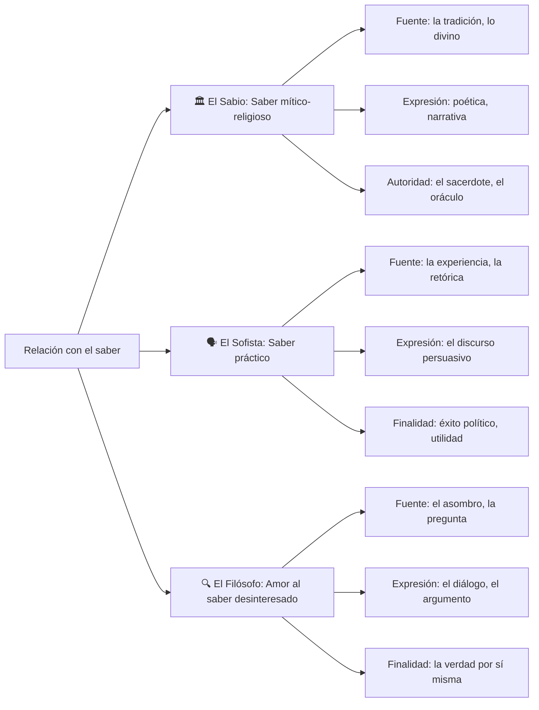
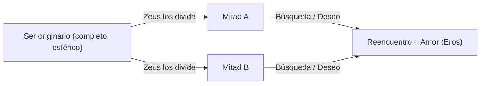
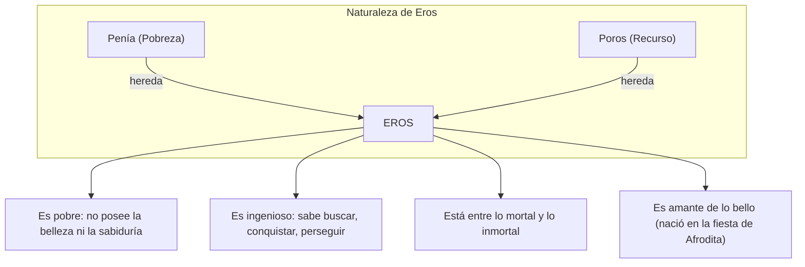
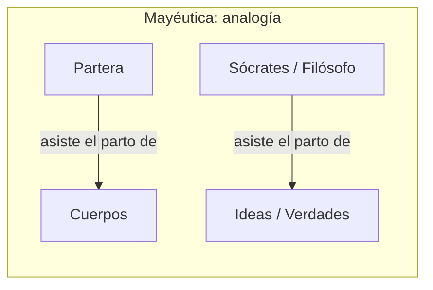
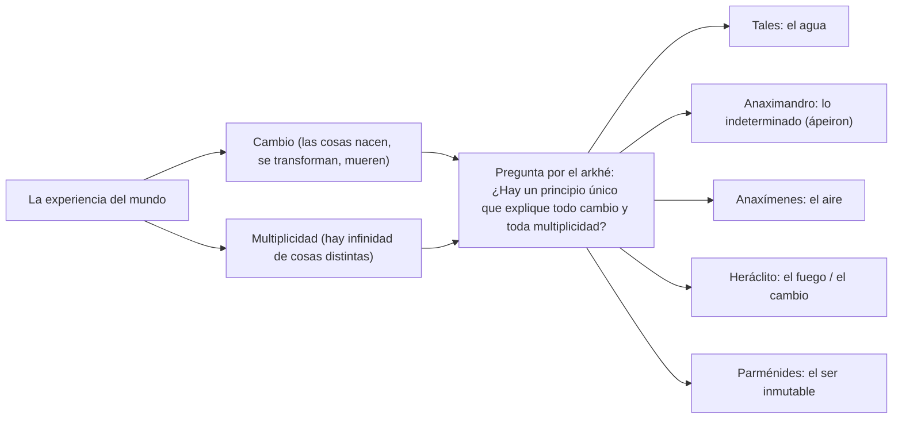
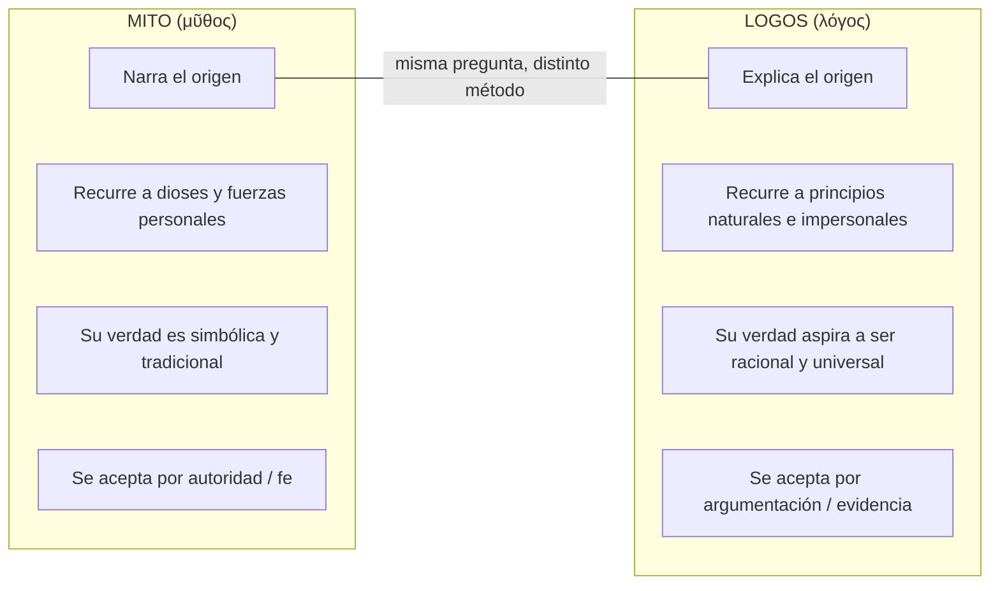
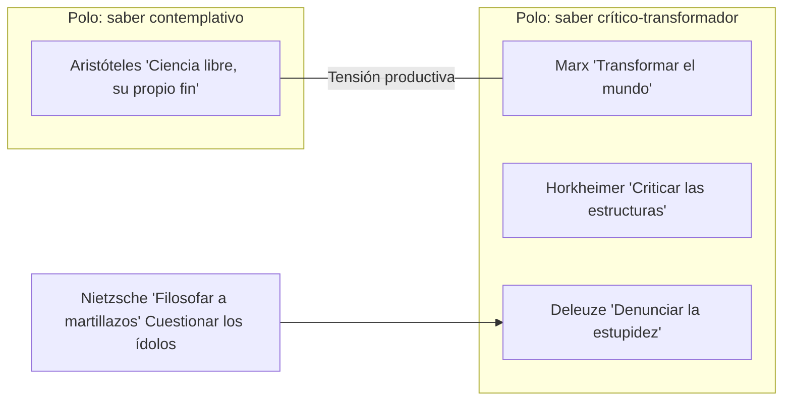
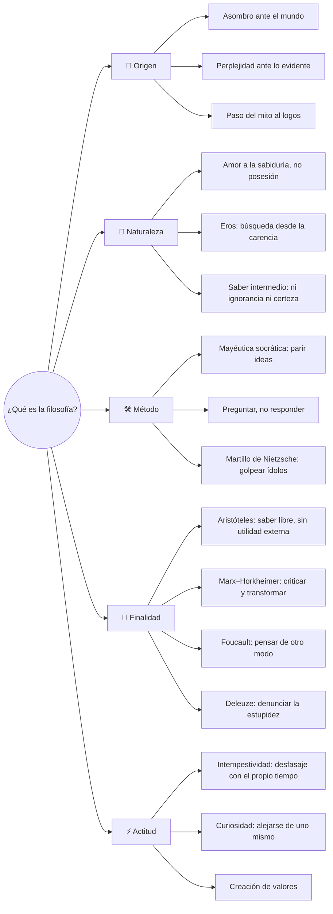

# Clase 1 — ¿Qué es la filosofía?

> *"¿Qué valdría el encarnizamiento del saber si sólo hubiera de asegurar la adquisición de conocimientos y no, en cierto modo y hasta donde se puede, el extravío del que conoce?"*
> — Michel Foucault, *Historia de la sexualidad 2*

---

## 1. Etimología: el nombre que ya es definición

La palabra **filosofía** proviene del griego antiguo:

| Raíz griega | Significado |
|---|---|
| **φίλος** (*phílos*) | amor, amistad, inclinación hacia |
| **σοφία** (*sophía*) | sabiduría, conocimiento profundo |

**Filosofía = amor a la sabiduría.**

Pero esta definición, aparentemente simple, esconde una tensión fundamental: el filósofo no *posee* la sabiduría, sino que la *desea*, la *busca*. Es un ser en movimiento, no en reposo. Esta distinción —entre *tener* y *buscar*— es el corazón mismo de la actividad filosófica.

---

## 2. Tres figuras del saber en la Grecia antigua

En la tradición griega no existía una única forma de relación con el conocimiento. Pueden distinguirse al menos tres figuras que encarnan modos distintos de vincularse con el saber:

### 2.1 El Sabio (σοφός — *sophós*)

El sabio es quien posee un conocimiento heredado, transmitido por la tradición. Su saber es **mítico**: se expresa a través de relatos sobre los dioses y el origen del mundo. Es un saber de carácter **religioso** y **poético**, donde la autoridad no reside en la argumentación racional sino en la figura del sacerdote, el poeta o el oráculo. Homero y Hesíodo son ejemplos paradigmáticos: sus obras (*Ilíada*, *Odisea*, *Teogonía*) constituían la "enciclopedia" del mundo griego, el depósito de verdades sobre los dioses, los héroes y la naturaleza del cosmos.

### 2.2 El Sofista (σοφιστής — *sophistés*)

El sofista es un maestro del **saber práctico**. A diferencia del sabio tradicional, el sofista enseña a cambio de dinero y su objetivo es formar ciudadanos hábiles para la vida pública: saber hablar, persuadir, argumentar en la asamblea o en los tribunales. Figuras como Protágoras y Gorgias dominaban la **retórica** como herramienta política. Para el sofista, la verdad es menos importante que la eficacia del discurso. Platón los criticará duramente por esto: no buscan *lo verdadero*, sino *lo útil*.

### 2.3 El Filósofo (φιλόσοφος — *philósophos*)

El filósofo se define por su **distancia respecto de lo práctico**. No posee la sabiduría (como el sabio) ni la vende (como el sofista): la *busca*. Su motor es el **asombro** (*thaumázein*), la perplejidad ante lo que parece evidente. Se aleja tanto de la autoridad mítica como de la utilidad retórica para perseguir el conocimiento **por sí mismo**, sin otra finalidad que comprender.

> *"Los hombres —ahora y desde el principio— comenzaron a filosofar al quedarse maravillados ante algo."*
> — Aristóteles, *Metafísica* 982b

---

## 3. El Banquete de Platón: Eros como figura del filósofo

En *El Banquete* (Συμπόσιον), Platón explora la naturaleza del amor (Eros) a través de una serie de discursos pronunciados durante un banquete. Este diálogo es central para entender la concepción platónica de la filosofía porque establece una analogía profunda: **el filósofo es un amante** —no alguien que ya posee la sabiduría, sino alguien que la desea con intensidad.

### 3.1 El Mito del Andrógino (discurso de Aristófanes)

Aristófanes narra que en el origen existían seres esféricos con cuatro brazos, cuatro piernas y dos rostros. Estos seres eran de tres tipos: masculino-masculino, femenino-femenino y masculino-femenino (el **andrógino**). Eran tan poderosos que amenazaron a los dioses, y Zeus decidió cortarlos por la mitad. Desde entonces, cada mitad busca desesperadamente a su otra mitad: eso es el **amor** — la búsqueda de una completitud perdida.

Este mito introduce una idea clave: **el amor no es plenitud sino carencia**. Amamos porque nos falta algo. Y así como el amante busca al amado, el filósofo busca la sabiduría que no posee.

### 3.2 El nacimiento de Eros (discurso de Sócrates/Diotima)

Sócrates relata lo que aprendió de **Diotima de Mantinea** sobre la naturaleza de Eros. Según este relato, Eros nació en la fiesta del nacimiento de **Afrodita** (diosa de la belleza), fruto de la unión de dos figuras:

| Progenitor | Nombre | Significado | Naturaleza |
|---|---|---|---|
| Madre | **Penía** (Πενία) | Pobreza, carencia | Lo que falta, el vacío, la necesidad |
| Padre | **Poros** (Πόρος) | Recurso, abundancia, camino | La inventiva, el ingenio, la riqueza |

De esta doble filiación, Eros hereda una **naturaleza dual**:

**Eros no es un dios, sino un daímon** (ser intermedio): ni sabio ni ignorante, ni mortal ni inmortal. Vive en la tensión entre la carencia y la conquista.

### 3.3 La analogía Eros–Filósofo

Esta es la clave del *Banquete* para la comprensión de la filosofía:

| | Eros | Filósofo |
|---|---|---|
| **¿Posee lo que busca?** | No posee la belleza | No posee la sabiduría |
| **¿Es ignorante?** | No: sabe que le falta algo | No: sabe que no sabe |
| **¿Qué hace?** | Busca, conquista, desea | Pregunta, examina, investiga |
| **Naturaleza** | Intermedia (daímon) | Intermedia (entre ignorancia y sabiduría) |

El filósofo no es *amante* en el sentido coloquial de "poseer" —es *amante* en el sentido de Eros: **el que desea lo que no tiene y no descansa hasta buscarlo**. Por eso Platón distingue entre ser "amante de la filosofía" (*philósophos*) y "poseedor de sabiduría" (*sophós*). El filósofo, como Eros, conquista y recibe a la vez: es activo en su búsqueda pero abierto a lo que la verdad le revele.

---

## 4. Sócrates: el filósofo como partero de almas

En el diálogo *Teeteto*, Platón presenta a Sócrates comparándose con su madre **Fenáreta**, que era partera. Sócrates practica la **mayéutica** (μαιευτική — *arte de partear*): así como la partera ayuda a dar a luz cuerpos, el filósofo ayuda a dar a luz **ideas**.

Características fundamentales de la mayéutica socrática:

1. **Sócrates se declara estéril en sabiduría**: no ofrece respuestas propias, sino que mediante preguntas ayuda al otro a descubrir lo que ya lleva dentro.
2. **La verdad no se transmite, se alumbra**: el filósofo no "enseña" en el sentido de depositar un saber; crea las condiciones para que el interlocutor piense por sí mismo.
3. **Discernir lo verdadero de lo falso**: como la partera distingue embarazos reales de imaginarios, Sócrates distingue ideas genuinas de meras opiniones.

> *"Mi arte de partear tiene las mismas características que el de ellas, pero se diferencia en el hecho de que asiste a los hombres y no a las mujeres, y examina las almas de los que dan a luz, pero no sus cuerpos."*
> — Platón, *Teeteto* 150b-c

---

## 5. Del Mito al Logos: el nacimiento del pensamiento filosófico

### 5.1 El concepto de Arkhé (ἀρχή)

**Arkhé** significa simultáneamente **origen**, **principio** y **fundamento**. Es el concepto central de la filosofía presocrática: la pregunta por aquello a partir de lo cual todo surge y a lo cual todo se remite.

La palabra *arkhé* sobrevive en numerosos términos actuales:

| Término | Composición | Significado |
|---|---|---|
| **Mon-arquía** | *mónos* (uno) + *arkhé* | Gobierno de un solo principio |
| **An-arquía** | *an-* (sin) + *arkhé* | Sin principio rector |
| **Arque-ología** | *arkhé* + *lógos* | Estudio de los orígenes |
| **Arqui-tectura** | *arkhé* + *tékhne* | Técnica del principio (del diseño fundante) |

Los primeros filósofos (presocráticos) buscaban un **arkhé único** que explicara la totalidad de lo real. Se enfrentaban a dos fenómenos fundamentales que exigían explicación:

El arkhé es el intento de **remitir la multiplicidad y el cambio a un principio unificador**: entender lo diverso como manifestación de lo uno.

### 5.2 Mito y Logos: dos modos de dar cuenta del origen

La transición del mito al logos no fue una ruptura abrupta sino un desplazamiento gradual en el modo de responder a la misma pregunta: *¿de dónde viene todo esto?*

| | **Mito** | **Logos** |
|---|---|---|
| **Operación** | Narrar | Explicar |
| **Agentes** | Dioses, héroes, fuerzas personificadas | Principios naturales, conceptos abstractos |
| **Criterio de verdad** | Tradición, autoridad sagrada | Argumentación racional, observación |
| **Ejemplo** | "Zeus envía el rayo" | "El rayo es una descarga eléctrica en la atmósfera" |
| **Relación con el tiempo** | Remite a un tiempo originario (*in illo tempore*) | Busca leyes que valen siempre |

El mito **narra** el origen de algo (el mundo, los dioses, los fenómenos) apelando a relatos sagrados. El logos **explica** esos mismos fenómenos buscando causas racionales y principios universales. La filosofía nace en este tránsito: del relato al argumento, de la narración a la explicación.

---

## 6. ¿Para qué "sirve" la filosofía?

Esta pregunta atraviesa la historia del pensamiento. ¿Tiene la filosofía una utilidad? ¿Debe tenerla? En clase se confrontaron dos posiciones paradigmáticas:

### 6.1 Aristóteles: la filosofía como saber "inútil" (y por eso, libre)

Para Aristóteles, la filosofía es la más elevada de las ciencias precisamente porque **no sirve para nada práctico**. No busca producir objetos, no busca utilidad, no busca poder. Es un saber que se persigue *por sí mismo*, como un hombre libre es aquel cuyo fin es él mismo y no otro.

> *"Es obvio que no la buscamos por ninguna utilidad, sino que, al igual que un hombre libre es, decimos, aquel cuyo fin es él mismo y no otro, así también consideramos que ésta es la única ciencia libre: solamente ella es, en efecto, su propio fin."*
> — Aristóteles, *Metafísica* 982b

La "inutilidad" de la filosofía es, paradójicamente, su **mayor dignidad**: es libre porque no está subordinada a ningún fin exterior.

### 6.2 Max Horkheimer y la Escuela de Frankfurt: la filosofía como crítica social

Frente a la posición aristotélica, **Max Horkheimer** (1895–1973), cofundador de la Escuela de Frankfurt y exponente de la **Teoría Crítica**, sostiene que la filosofía sí tiene una función social ineludible: **criticar**. Para Horkheimer, una filosofía que se desentiende de las condiciones sociales, que no cuestiona las estructuras de poder, traiciona su propia vocación.

La Teoría Crítica hereda de Marx la idea de que el pensamiento no puede limitarse a contemplar el mundo tal como es:

> *"Los filósofos no han hecho más que interpretar de diversos modos el mundo, pero de lo que se trata es de transformarlo."*
> — Karl Marx, *Tesis sobre Feuerbach*, Tesis XI (1845)

### 6.3 Deleuze: la filosofía como empresa de desmitificación

Gilles Deleuze radicaliza esta posición: la filosofía **sirve para entristecer**, para incomodar, para denunciar la estupidez y la bajeza del pensamiento. Su función es ser **crítica de todas las mistificaciones**:

> *"La filosofía no sirve ni al Estado ni a la Iglesia, que tienen otras preocupaciones. No sirve a ningún poder establecido. La filosofía sirve para entristecer. Una filosofía que no entristece o no contraría a nadie no es una filosofía."*
> — Deleuze, *Nietzsche y la filosofía* (1962)

### 6.4 Mapa de posiciones sobre la utilidad de la filosofía

Esta tensión no se resuelve eligiendo un polo: la historia de la filosofía puede leerse como un diálogo permanente entre la búsqueda desinteresada de la verdad y la urgencia de la crítica social.

---

## 7. Nietzsche: filosofar a martillazos

Friedrich Nietzsche aporta una imagen poderosa del trabajo filosófico: el filósofo usa el martillo como un **diapasón**, golpeando los ídolos —las ideas aceptadas, las verdades dadas por obvias— para escuchar si suenan *huecos*.

> *"Ir haciendo preguntas a base de golpearlos con el martillo, y oír tal vez, como respuesta, a ese conocido sonido a hueco que revela unas entrañas llenas de aire."*
> — Nietzsche, *Crepúsculo de los ídolos* (1889)

El filósofo, según Nietzsche, no es un académico que clasifica saberes: es un **creador de valores**, alguien que ha recorrido todas las perspectivas posibles —ha sido "crítico y escéptico y dogmático e historiador y poeta"— para poder finalmente **crear** algo nuevo.

> *"Un filósofo: es un hombre que constantemente vive, ve, oye, sospecha, espera, sueña cosas extraordinarias (...) un ser que con frecuencia huye de sí mismo (...) pero que es demasiado curioso para no «volver a sí mismo» una y otra vez."*
> — Nietzsche, *Más allá del bien y del mal*, § 292

---

## 8. Pensar como contemporáneo: Agamben y lo intempestivo

Giorgio Agamben retoma a Nietzsche para formular una idea provocadora: **ser contemporáneo no es coincidir con su tiempo, sino estar en desfasaje con él**. El verdadero contemporáneo es aquel que puede ver las sombras de su época precisamente porque no está cegado por sus luces.

El filósofo es, en este sentido, siempre **intempestivo**: no se adecua a las pretensiones de su tiempo, no celebra acríticamente la cultura vigente, y por eso es capaz de percibir lo que los demás no ven.

> *"Pertenece verdaderamente a su tiempo, es verdaderamente contemporáneo aquel que no coincide perfectamente con él ni se adecua a sus pretensiones."*
> — Giorgio Agamben, *¿Qué es lo contemporáneo?* (2008)

---

## 9. Foucault: la filosofía como ejercicio crítico sobre sí mismo

Michel Foucault cierra el arco de reflexiones del material con una definición de la filosofía como **trabajo crítico del pensamiento sobre sí mismo**. No se trata de acumular conocimientos ni de dictar verdades a otros, sino de preguntarse: *¿puedo pensar de otro modo?*

> *"¿Qué es la filosofía hoy —quiero decir la actividad filosófica— sino el trabajo crítico del pensamiento sobre sí mismo?"*
> — Foucault, *Historia de la sexualidad 2* (1984)

La filosofía como **ensayo** —como prueba, como ejercicio de transformación de uno mismo— es una *ascesis*: una práctica que modifica al que la ejerce.

---

## 10. Síntesis: ¿qué es la filosofía?

---

## 11. Textos de referencia del material de clase

| Autor | Obra | Año | Concepto clave |
|---|---|---|---|
| Platón | *Teeteto* (149a–150d) | c. 369 a.C. | Mayéutica: el filósofo como partero de almas |
| Platón | *El Banquete* | c. 385 a.C. | Eros como figura del filósofo; mito del andrógino |
| Aristóteles | *Metafísica* (982b) | c. 350 a.C. | Asombro como origen; filosofía como ciencia libre |
| Hegel | *Enciclopedia de las ciencias filosóficas* | 1817 | Filosofía como contemplación pensante |
| Marx | *Tesis sobre Feuerbach* (Tesis XI) | 1845 | Transformar el mundo, no solo interpretarlo |
| Nietzsche | *Crepúsculo de los ídolos* | 1889 | Filosofar a martillazos: cuestionar los ídolos |
| Nietzsche | *Más allá del bien y del mal* (§ 211, 292) | 1886 | El filósofo como creador de valores |
| Deleuze | *Nietzsche y la filosofía* | 1962 | Filosofía como empresa de desmitificación |
| Foucault | *Historia de la sexualidad 2* | 1984 | Filosofía como ejercicio crítico del pensamiento sobre sí mismo |
| Agamben | *¿Qué es lo contemporáneo?* | 2008 | Lo contemporáneo como intempestivo |

---

## 12. Glosario de conceptos clave

| Concepto | Griego | Definición |
|---|---|---|
| **Filosofía** | φιλοσοφία | Amor a la sabiduría; búsqueda del conocimiento por sí mismo |
| **Arkhé** | ἀρχή | Principio, origen, fundamento de todas las cosas |
| **Logos** | λόγος | Razón, discurso, explicación racional |
| **Mito** | μῦθος | Relato tradicional que narra el origen de algo |
| **Thaumázein** | θαυμάζειν | Asombro, maravilla; origen del filosofar según Aristóteles |
| **Mayéutica** | μαιευτική | Arte de partear ideas; método socrático |
| **Eros** | Ἔρως | Amor/deseo; figura intermedia entre carencia y plenitud |
| **Sophós** | σοφός | Sabio; quien posee la sabiduría |
| **Sophistés** | σοφιστής | Sofista; maestro de retórica y saber práctico |
| **Philósophos** | φιλόσοφος | Amante de la sabiduría; quien busca sin poseer |
| **Penía** | Πενία | Pobreza, carencia (madre de Eros) |
| **Poros** | Πόρος | Recurso, ingenio (padre de Eros) |
| **Daímon** | δαίμων | Ser intermedio entre lo humano y lo divino |
