# Segundo parcial — Hegel, Nietzsche, Sartre y Beauvoir

> Guía de estudio para el parcial. Cubre a los cuatro autores que entran: **Hegel** (*Fenomenología del Espíritu*), **Nietzsche** (*Sobre verdad y mentira* + *Cómo el "mundo verdadero" acabó convirtiéndose en una fábula*), **Sartre** (*El existencialismo es un humanismo*, pp. 21–40) y **Simone de Beauvoir** (*El segundo sexo*, Introducción, pp. 47–64).

> **Cómo aprovecharla.** Cada autor sigue el mismo molde: primero el problema que lo motiva, después las ideas una por una con su diagrama o ejemplo, y al final una síntesis con mapa, glosario y una fórmula breve para repasar. Con poco tiempo, conviene leer las fórmulas finales de cada parte y la Parte VI; con más margen, vale la pena hacer el recorrido completo, porque las ideas se entienden mejor encadenadas que sueltas.

---

## Tabla de contenidos


| Parte                                                                                               | Temas                                                              |
| --------------------------------------------------------------------------------------------------- | ------------------------------------------------------------------ |
| [I. Hegel — Fenomenología](#parte-i-hegel--el-problema-del-conocimiento-fenomenología-del-espíritu) | Saber y ser, conciencia, experiencia, saber absoluto               |
| [II. Síntesis Hegel](#parte-ii-síntesis-hegel-para-el-examen)                                       | Mapa, ideas clave, glosario, fórmula                               |
| [III. Nietzsche](#parte-iii-nietzsche--verdad-lenguaje-ficción-y-mundo-verdadero)                   | Verdad extramoral, lenguaje, mundo verdadero, nihilismo            |
| [IV. Sartre (pp. 21–40)](#parte-iv-sartre--el-existencialismo-es-un-humanismo)                      | Críticas, existencia/esencia, responsabilidad, angustia, desamparo |
| [V. Beauvoir (pp. 47–64)](#parte-v-simone-de-beauvoir--el-segundo-sexo)                             | ¿Qué es una mujer?, Alteridad, situación, libertad                 |
| [VI. Síntesis final](#parte-vi-síntesis-comparativa-del-parcial)                                    | Mapa comparativo, frases clave                                     |


---

## Parte I: Hegel — El problema del conocimiento (Fenomenología del Espíritu)

**De dónde sale:** del planteo sobre el saber y el ser en la *Fenomenología del Espíritu*, sobre todo de la Introducción y del recorrido que hace la conciencia a lo largo del libro.

### Punto de partida

La modernidad parte siempre del **sujeto que conoce** y enseguida tropieza con un problema: ¿cómo pruebo que el mundo exterior es real? Hegel invierte el planteo. No parte del sujeto aislado, sino del **ser**.

¿Qué quiere decir "ser" acá? No es una cosa entre otras ni un objeto particular, sino **la totalidad de lo que es**: la realidad entendida como un todo. Para Hegel ese todo no es algo fijo y muerto, sino un **proceso vivo que se despliega y se desarrolla**, y que incluye tanto a las cosas como al pensamiento que las conoce. Dicho simple: el "ser" es el conjunto de todo lo real en movimiento, y nosotros —los sujetos que conocemos— somos una parte de ese todo, no espectadores ubicados afuera.

De ahí la consecuencia clave: para él, el saber no es algo que un sujeto aplica al mundo desde afuera, sino un **movimiento que pertenece al ser mismo**. El ser, al desarrollarse, llega a conocerse a sí mismo a través de la conciencia humana.


| El enfoque moderno                              | El enfoque de Hegel                              |
| ----------------------------------------------- | ------------------------------------------------ |
| El sujeto enfrentado al objeto                  | El saber y el ser dentro de un **mismo proceso** |
| Conocer es aplicarle un instrumento a las cosas | Conocer es el **movimiento del propio ser**      |
| Una representación mental de objetos externos   | La conciencia **inmersa** en el ser              |


Las dos columnas se entienden mejor desglosadas:

- **"Conocer es aplicarle un instrumento a las cosas"** (la idea moderna que Hegel rechaza): supone que el conocimiento es como una *herramienta* que el sujeto usa para acercarse a una realidad que está afuera y separada de él, como quien usa unos anteojos, una lupa o una red para atrapar al objeto. El problema es que toda herramienta modifica lo que toca, así que nunca sabríamos si conocemos la cosa o solo el efecto del instrumento (esta crítica se desarrolla en el punto 9.a).
- **"Conocer es el movimiento del propio ser"** (la propuesta de Hegel): el conocimiento no es una herramienta externa, sino el **proceso mismo por el cual la realidad se va volviendo consciente de sí**. No hay un sujeto de un lado y un objeto del otro unidos por un instrumento; hay un único proceso —el ser desarrollándose— y el conocer es un *momento* de ese desarrollo. Conocer no es algo que le hacemos al ser desde afuera: es algo que **le pasa al ser** cuando llega a pensarse a sí mismo.
- **"La conciencia inmersa en el ser"** (frente a "una representación mental de objetos externos"): no estamos encerrados en nuestra cabeza fabricando copias o fotos mentales de un mundo que quedaría del otro lado. La conciencia está **sumergida, metida dentro** de la realidad que conoce, formando parte de ella. Por eso conocer no es copiar desde lejos, sino participar del propio movimiento de lo real.


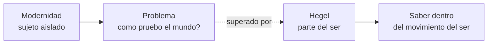


---

### 1. El saber y el ser no están separados

Hegel se ubica en una tradición que entiende el saber **desde el ser**, y no desde un sujeto que se queda afuera representando objetos.

Recordemos que "ser" significa acá **la totalidad de lo real**, ese todo en desarrollo del que hablábamos arriba. Con eso en mente:

- El ser humano **no está frente al mundo** como un observador externo. Está **dentro de esa totalidad** (el ser): es una parte del mundo que lo conoce desde adentro, no una mente separada que lo mira desde una orilla. Cuando conocemos, no salimos de la realidad para fotografiarla: la realidad se conoce a través nuestro.
- Las cosas tampoco son objetos sueltos puestos delante de una conciencia: existen dentro de una **red de relaciones**. Una cosa es lo que es por su lugar respecto de las demás (causas, diferencias, semejanzas), no como un átomo aislado.

Por eso la pregunta cambia de forma:

```
La pregunta floja:  "Como conoce el sujeto al objeto?"
La pregunta buena:  "Como se relacionan saber y ser, si los dos son parte de un mismo proceso?"
```

El saber **no le es externo** al ser. Es decir: el conocimiento no es algo que se le suma a la realidad desde afuera, como una etiqueta o un reflejo agregado. La capacidad de conocer ya está, en potencia, dentro de la realidad misma. Lo que ocurre es que ese saber, que estaba latente en el ser, **se vuelve explícito (sale a la luz) cuando aparece la conciencia**: la conciencia es el momento en que el ser empieza a saberse a sí mismo. En otras palabras, no es que primero exista un mundo mudo y después llegue desde afuera un sujeto a conocerlo; el conocer es el modo en que el propio ser se vuelve transparente para sí.

---

### 2. En sí, para otro y para sí

Hay tres nociones que conviene tener bien claras, porque reaparecen todo el tiempo.

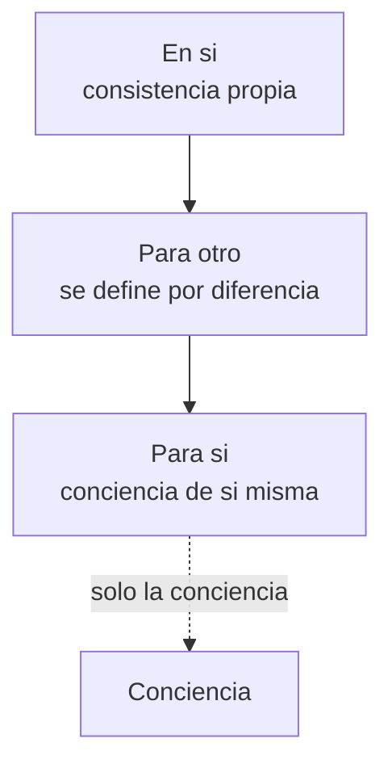


| Categoría     | Qué quiere decir                                                         | Ejemplo                                                      |
| ------------- | ------------------------------------------------------------------------ | ------------------------------------------------------------ |
| **En sí**     | La cosa se sostiene sola, tiene una consistencia propia                  | Una piedra es una piedra                                     |
| **Para otro** | La cosa se presenta y se diferencia frente a las demás                   | La piedra es piedra porque no es agua, ni fuego, ni un árbol |
| **Para sí**   | El ente puede **saberse a sí mismo** y reflexionar sobre su propio saber | La conciencia se pregunta quién es y cómo conoce             |


Conviene ver las tres categorías con varios ejemplos, porque es una distinción que vuelve todo el tiempo:

- **En sí**: la cosa *tal como es por sí misma*, con independencia de que alguien la mire o de con qué se la compare. Una **semilla** en sí ya contiene lo que es (su consistencia propia). Un **árbol** es un árbol; el **agua** es agua. Es el punto de partida: la cosa en su mera existencia.
- **Para otro**: la cosa *en relación con las demás*, definida por contraste y diferencia. La semilla es semilla **porque no es todavía el árbol**; el agua se entiende **frente al** fuego; el color rojo se distingue **por no ser** azul ni verde. Nada se define en el vacío: todo se recorta sobre un fondo de relaciones con lo demás. Acá ya no miramos la cosa sola, sino su lugar dentro de la red.
- **Para sí**: el ente que, además de ser y de relacionarse, **es consciente de sí mismo** y puede reflexionar sobre su propio conocer. Esto **solo lo logra la conciencia**. Una piedra no sabe que es una piedra; un animal vive, pero no se pregunta por su propio saber. En cambio, un ser humano puede pensar "yo sé esto", "me equivoqué", "¿cómo llegué a saberlo?". Ejemplos: el estudiante que se da cuenta de que entendió mal un tema y revisa su error; o la conciencia que se pregunta quién es y cómo conoce.

La gran diferencia es esa última: solo la conciencia es **para sí**, y esa capacidad de saberse a sí misma —y de saber *cómo* sabe— es lo que a Hegel le importa de verdad. De hecho, el recorrido de la *Fenomenología* es el pasaje desde un saber que mira solo las cosas (en sí / para otro) hacia un saber que se vuelve sobre sí mismo (para sí).

---

### 3. La conciencia mete una ruptura en el ser

Cuando aparece la conciencia, el ser deja de estar quieto y cerrado sobre sí mismo. El saber introduce **inquietud, ruptura, desgarramiento**.

La conciencia no deja las cosas como están: al conocerlas, las **separa, las compara, las relaciona** y las transforma en objeto de pensamiento.

> *"El Espíritu solo conquista su verdad cuando es capaz de encontrarse a sí mismo en el absoluto desgarramiento."*

Esa frase es clave: la verdad no llega de la mano de una armonía tranquila, sino que se gana atravesando **conflictos, contradicciones, errores y superaciones**.

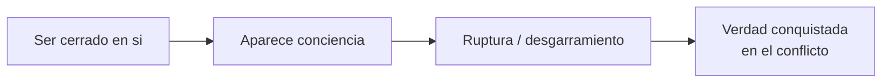


---

### 4. La crítica al sujeto moderno

Hegel cuestiona la idea moderna de que el sujeto se ubica **frente** al mundo y lo **representa**, como quien mira objetos desde cierta distancia.

¿Qué es la **representación moderna**? Es la imagen del conocimiento que comparten Descartes, Locke o Kant: en la mente hay una especie de "pantalla interior" donde se forman copias, imágenes o ideas de las cosas externas. Conocer sería lograr que esa copia mental coincida con el objeto de afuera. El sujeto queda de un lado (adentro, con sus representaciones) y el mundo del otro (afuera, dado de antemano). Ejemplo: veo un árbol y formo en mi cabeza una "foto" del árbol; el conocimiento es esa foto, y el árbol real sigue intacto y separado, esperando ser copiado.

¿Qué es, en cambio, la **experiencia hegeliana**? Para Hegel conocer no es sacar una foto, sino atravesar una **experiencia** que *transforma* a las dos partes: cambia el objeto (porque al conocerlo lo entiendo de otra manera, descubro relaciones y aspectos que antes no veía) y cambia también a la conciencia (porque revisa sus criterios y sale del proceso siendo otra). Ejemplo: estudio en serio ese árbol y empiezo a verlo como organismo, como parte de un ecosistema, como resultado de una historia; el "objeto" ya no es el mismo de la primera mirada ingenua, y yo tampoco pienso igual que antes.


| La representación moderna                 | La experiencia hegeliana                                                  |
| ----------------------------------------- | ------------------------------------------------------------------------- |
| Conocer es copiar mentalmente los objetos | Conocer es una **experiencia** que transforma a la conciencia y al objeto |
| El sujeto está separado del mundo         | El ser humano está **adentro** del mundo                                  |
| El objeto viene dado de antemano          | Las cosas se le **presentan** a la conciencia                             |


Una aclaración sobre la última fila: que el objeto "venga dado de antemano" significa que ya estaría completo y definido antes de que lo conozcamos, esperando a ser copiado tal cual. Que en cambio las cosas "se le **presentan** a la conciencia" significa que el objeto se va mostrando *dentro del proceso de conocerlo*, y va revelando aspectos nuevos a medida que la conciencia lo trabaja: no está terminado de antemano, se constituye en la relación.

La conclusión es fuerte: conocer no es reproducir objetos externos en la cabeza, sino hacer una **experiencia** en la que tanto la conciencia como el objeto terminan cambiando.

---

### 5. El conocimiento exige trabajo

A la verdad no se llega por una intuición instantánea ni con una impresión inmediata. La verdad exige **trabajo del pensamiento**:

- separar (distinguir un aspecto de otro en lo que al principio se ve mezclado),
- comparar (ponerlo al lado de otras cosas para ver semejanzas y diferencias),
- relacionar (encontrar conexiones, causas y dependencias entre ellas),
- y superar las contradicciones que van apareciendo (cuando dos ideas chocan, no quedarse paralizado, sino integrarlas en una comprensión más amplia).

No conocemos la esencia de las cosas de manera directa: la conocemos **poniéndolas en relación** con otras.

¿A qué **camino** se refiere Hegel? No a una metáfora vaga, sino a un recorrido concreto con etapas. La conciencia arranca con una forma de saber que cree segura y completa (por ejemplo, "lo verdadero es lo que percibo directamente con los sentidos"). Al ponerla a prueba contra la experiencia, descubre que esa certeza era **parcial** y se contradice. Esa crisis la obliga a abandonar esa forma y pasar a otra más rica (por ejemplo, del puro percibir al entender mediante leyes y conceptos). Y así sucesivamente: cada etapa supera a la anterior conservando lo que tenía de válido. La suma de todas esas etapas, una detrás de otra, es el **camino** que va de los saberes más simples e ingenuos hasta el saber absoluto.

Por eso conviene leer la *Fenomenología del Espíritu* como el relato de ese camino: un itinerario de formas de conciencia (certeza sensible → percepción → entendimiento → autoconciencia → razón → espíritu → saber absoluto) que la conciencia atraviesa hasta llegar a saberse plenamente a sí misma. El "trabajo" del que habla Hegel es, justamente, recorrer ese camino sin saltearse etapas.

---

### 6. Una "ciencia de la experiencia de la conciencia"

Hegel define su obra como una **ciencia de la experiencia de la conciencia**: lo que hace es describir, una por una, las experiencias por las que pasa la conciencia hasta que logra **saberse a sí misma**.

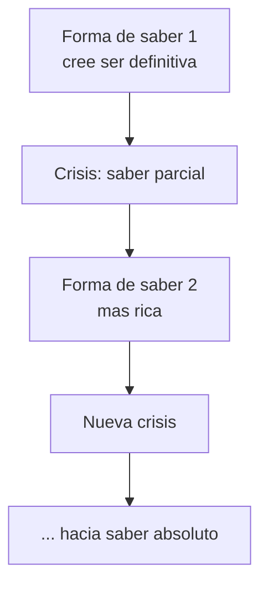


El patrón se repite: en cada etapa la conciencia cree que ya tocó la verdad, después descubre que su saber era **parcial**, y esa crisis la empuja a **cambiar de perspectiva**. Por eso, en Hegel, el conocimiento nunca es algo estático: es un **proceso histórico, dinámico y conflictivo**.

---

### 7. El saber absoluto

Acá hay un malentendido habitual que conviene desactivar: el saber absoluto **no** es saberlo "todo", como si fuera una enciclopedia infinita de datos.

El saber absoluto es el saber que **comprende el recorrido completo** de la conciencia:

```
meta + resultado + camino + errores + experiencias parciales
+ contradicciones + superaciones
```


| Rasgo               | Qué significa                                                         |
| ------------------- | --------------------------------------------------------------------- |
| **Absoluto**        | Integra todas las experiencias anteriores en una totalidad más amplia |
| **Saber del saber** | La conciencia sabe **cómo** llegó a saber, no solo conoce objetos     |
| **Retrospectivo**   | Recoge el camino y lo entiende como una serie de momentos necesarios  |


---

### 8. Una conciencia individual y colectiva

La conciencia no es solamente individual: también es **colectiva**.

- Hegel la piensa como un **"nosotros"**.
- Se forma en relación con **otras conciencias**.
- No somos sujetos aislados que conocen en soledad: la **intersubjetividad** es parte esencial del saber.

Por eso el camino del conocimiento es **histórico y colectivo**, y no un asunto puramente privado.

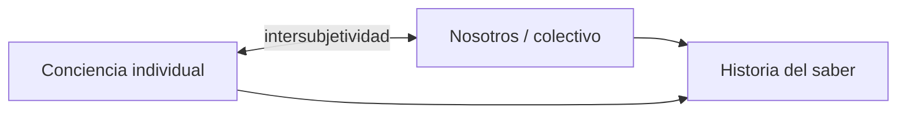


---

### 9. La crítica de Hegel a otras ideas del conocimiento

En la Introducción de la *Fenomenología*, Hegel se toma el trabajo de aclarar lo que el conocimiento **no es**. Son cuatro rechazos:

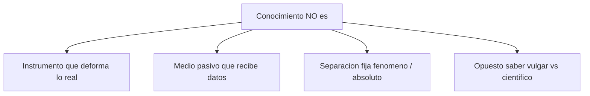


#### a) No es un instrumento

La idea que Hegel rechaza es esta: que el conocimiento sea una **herramienta** que usamos para alcanzar la verdad, como si la mente fuera unos anteojos, una lupa o un martillo aplicado a las cosas. Suena razonable, pero lleva a un callejón sin salida.

El razonamiento es simple: toda herramienta **modifica aquello sobre lo que actúa**. Un martillo deforma lo que golpea; unos anteojos cambian lo que se ve. Si el conocimiento fuera una herramienta así, entonces nunca conoceríamos la cosa *tal como es*, sino solo la cosa **ya deformada** por el instrumento.

¿Y por qué no se puede "descontar" esa deformación? Para restarle a la imagen lo que el instrumento le agregó, yo tendría que saber **cómo es la realidad sin el instrumento**. Pero conocer la realidad sin deformaciones es, justamente, lo que todavía no tengo (¡es lo que estoy buscando!). Caería en un círculo: necesito el resultado para empezar.

> Ejemplo: si afirmo que mis anteojos distorsionan los colores, para corregir esa distorsión necesito saber de qué color son realmente las cosas **sin** los anteojos. Pero si ya supiera eso, no necesitaría corregir nada. El supuesto saber previo, "puro", es imposible.

Conclusión: no tiene sentido analizar primero "el instrumento del conocer" para recién después ponerse a conocer, como si hubiera que revisar la herramienta antes de usarla (esto va, sobre todo, contra Kant, que quería examinar la facultad de conocer antes de conocer). Para Hegel hay que **meterse directamente en la experiencia del objeto**: el conocimiento no es un aparato externo que se interpone, sino el propio proceso por el cual la cosa se va mostrando y la conciencia se va corrigiendo a sí misma sobre la marcha.

#### b) No es un medio pasivo

También cuestiona al **empirismo** (Locke): conocer no es recibir impresiones sensibles y combinarlas como quien junta piezas. El conocimiento es **activo, histórico y dialéctico**.

#### c) No hay una separación rígida entre fenómeno y absoluto

Kant había dicho que conocemos los fenómenos, pero no la cosa en sí. Hegel **no se resigna a eso**: la verdad no queda encerrada en un más allá inaccesible, porque el conocimiento **avanza hacia lo absoluto**, aunque lo haga mediante un proceso.

#### d) No hay un saber elevado contra un saber vulgar

La ciencia no puede despreciar al saber común. Los saberes parciales **no son simplemente falsos**: son **momentos necesarios** del desarrollo del saber.

---

### 10. Entendimiento y razón

Esta distinción suele aparecer en el parcial, así que conviene tenerla bien clara.


|                        | **Entendimiento**                                                    | **Razón**                                                 |
| ---------------------- | -------------------------------------------------------------------- | --------------------------------------------------------- |
| **Qué hace**           | Separa, clasifica y fija oposiciones                                 | Comprende las relaciones y el movimiento                  |
| **Cómo piensa**        | En dicotomías: sujeto/objeto, fenómeno/absoluto, naturaleza/libertad | Integra las oposiciones en una totalidad dinámica         |
| **Su límite**          | Es necesario, pero se queda corto                                    | Capta la contradicción, la transformación y la superación |
| **El verdadero saber** | No llega al movimiento total                                         | Es **racional**: saber es saber el proceso                |


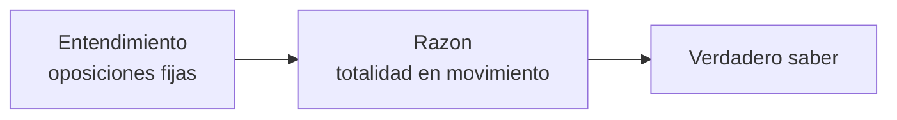


---

### 11. La verdad como proceso

Hegel le da otro contenido a la idea clásica de verdad: ya no es solo una **correspondencia fija** entre la idea y la cosa. La verdad aparece cuando la conciencia **confronta** lo que cree saber con lo que el objeto efectivamente le muestra.

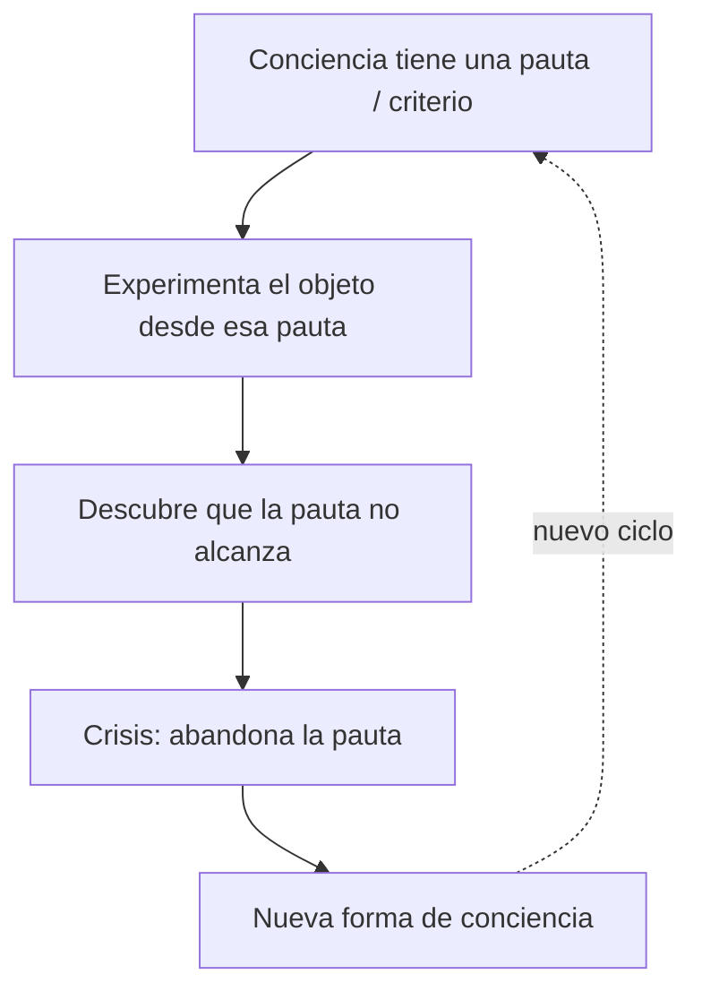


Un ejemplo simple para fijar el mecanismo:

1. La conciencia cree que el mundo es algo completamente externo a ella.
2. Experimenta el mundo desde esa pauta.
3. Descubre que la explicación no le alcanza.
4. Modifica su saber.
5. Surge una nueva forma de conciencia.

En definitiva, la verdad no cae de golpe: se **construye** a lo largo de un recorrido.

---

### 12. El camino de la conciencia (duda y desesperación)

La *Fenomenología* narra el camino de la **conciencia natural** hacia el verdadero saber. Y no es un camino lineal ni cómodo: está lleno de **errores, conflictos y frustraciones**. Hegel lo llama, sin eufemismos, el camino de la **duda** o de la **desesperación**.

¿Por qué "desesperación"? Porque cada vez que la conciencia cree haber alcanzado una verdad, descubre que esa verdad **se le derrumba** y pierde lo que daba por seguro. Pero esa pérdida **no es inútil**: es justamente lo que le permite avanzar hacia un saber más rico.

> La conciencia **progresa perdiendo** sus certezas anteriores. Equivocarse no la deja afuera del saber: la mete adentro del camino.

---

### 13. Qué entiende Hegel por "experiencia"

Ojo con esta palabra, porque no significa lo mismo que en las ciencias naturales. "Experiencia" no es solo lo sensible o lo empírico. En Hegel incluye:

- la relación con el mundo,
- la **historia**,
- el trato con otros seres humanos,
- la formación de la conciencia,
- y también los errores, los conflictos y las transformaciones del saber.

> *"Este movimiento dialéctico que la conciencia ejerce en ella misma, tanto en su saber como en su objeto, en tanto de allí surge para ella el nuevo objeto verdadero, es lo que propiamente se llama experiencia."*

Es decir: la experiencia no es recibir información, sino una **transformación** de la conciencia y del objeto tal como se le aparece.

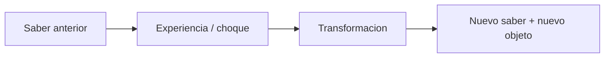


---

### 14. Dos niveles: la conciencia y el "nosotros"

Una distinción fina pero importante: en la *Fenomenología* hay dos miradas en juego.


| Nivel             | Quién es                                     | Qué sabe                                                                                    |
| ----------------- | -------------------------------------------- | ------------------------------------------------------------------------------------------- |
| **La conciencia** | La que vive las experiencias en carne propia | No sabe hacia dónde va; cada forma de saber le parece definitiva, hasta que entra en crisis |
| **El "nosotros"** | La conciencia filosófica                     | Mira el camino **en retrospectiva** y ve cómo cada etapa forma parte de un proceso mayor    |


Dicho corto: la conciencia **vive** el camino sin terminar de entenderlo, mientras que el filósofo lo **reconstruye** conceptualmente.

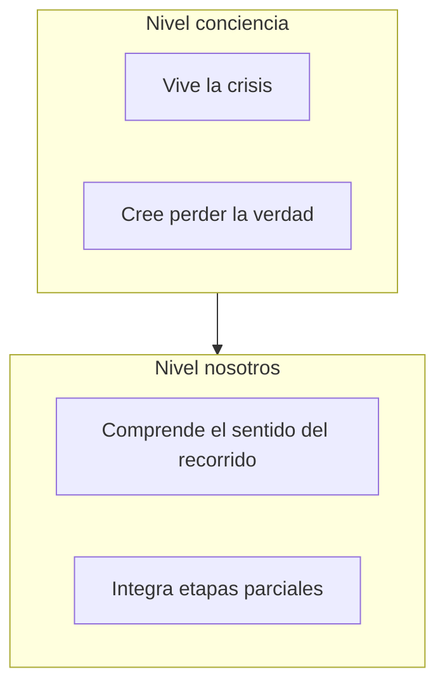


---

### 15. El saber absoluto como saber de los límites

Para cerrar a Hegel, una precisión importante: el saber absoluto **no** es una reconciliación perfecta y cerrada entre el pensamiento y la realidad.

- No significa que se acaben la diferencia, el conflicto o la experiencia.
- Es, más bien, la conciencia de que el saber es **dinámico, histórico, contradictorio y abierto**.
- Y es un **saber de los propios límites**: cada forma de saber es parte de un proceso, y la totalidad funciona como un **horizonte**, no como un punto muerto.

> Por eso el saber absoluto es **retrospectivo**: recoge las experiencias pasadas y las entiende como momentos necesarios del camino.

---

## Parte II: Síntesis Hegel (para el examen)

### Mapa conceptual

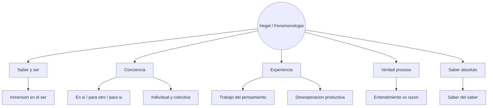


### Ideas centrales para recordar

1. Hegel **no** piensa el conocimiento como un sujeto aislado frente a un objeto externo: el saber está **dentro del ser**.
2. La conciencia se conoce a sí misma **a través de las cosas** y de **otras conciencias**.
3. Conocer exige **trabajo, mediación, experiencia y conflicto**; no es una intuición inmediata.
4. La *Fenomenología* narra el camino hacia el **saber absoluto**.
5. El saber absoluto es comprender el **recorrido completo**, con sus errores, crisis y superaciones.
6. La verdad es un **proceso dialéctico**, no un resultado fijo.
7. Cada saber parcial es un **momento necesario**, no un simple error.
8. La experiencia es la formación **histórica** de la conciencia, no una mera percepción.
9. El camino duele: hay que **perder certezas** para poder avanzar.
10. El saber absoluto es un **saber del saber**, con conciencia de sus propios límites.

### Glosario rápido


| Concepto                        | Definición                                                    |
| ------------------------------- | ------------------------------------------------------------- |
| **En sí / para otro / para sí** | Los tres modos del ser; solo la conciencia llega al "para sí" |
| **Experiencia**                 | El movimiento dialéctico que transforma al saber y al objeto  |
| **Entendimiento**               | La facultad que separa y fija oposiciones                     |
| **Razón**                       | La que integra las oposiciones en una totalidad móvil         |
| **Saber absoluto**              | La comprensión retrospectiva del camino completo del saber    |
| **Nosotros**                    | La perspectiva filosófica sobre el recorrido de la conciencia |
| **Desesperación**               | La pérdida productiva de las certezas parciales               |


### Fórmula breve para repasar

> Para Hegel, conocer no es que un sujeto separado represente objetos externos, sino que la conciencia, **inmersa en el ser**, atraviesa experiencias en las que su saber entra en crisis, se transforma y se supera. La verdad no aparece de golpe, sino como resultado de un **proceso dialéctico**. Y el saber absoluto no consiste en saberlo todo, sino en comprender el **camino completo** por el cual la conciencia llega a saberse a sí misma y al ser del que forma parte.

---

## Parte III: Nietzsche — Verdad, lenguaje, ficción y "mundo verdadero"

**Los dos textos que entran:**

- *Sobre verdad y mentira en sentido extramoral* (1873).
- *Crepúsculo de los ídolos* — *Cómo el "mundo verdadero" acabó convirtiéndose en una fábula* (1888).

---

### 1. La idea general

Los dos textos atacan dos problemas que, en el fondo, son el mismo.


| Texto                       | Qué problema toca                                                                                                               |
| --------------------------- | ------------------------------------------------------------------------------------------------------------------------------- |
| *Sobre verdad y mentira*    | Discute la idea de que la verdad sea una **copia objetiva** de la realidad                                                      |
| *Mundo verdadero... fábula* | Lee la historia de la filosofía occidental como la **historia de un error**: haber inventado un mundo verdadero superior a este |


La tesis general es que eso que llamamos "verdad" no es una realidad absoluta, eterna y objetiva, sino una **construcción humana**: una ficción útil, una interpretación que con el tiempo se olvidó de que era ficción.

Por eso Nietzsche no se queda en preguntar si algo es verdadero o falso. Va más a fondo:

```
¿De donde salio nuestra idea de verdad?
¿Para que sirve?
¿Que tipo de vida expresa?
¿Favorece o niega la vida?
```

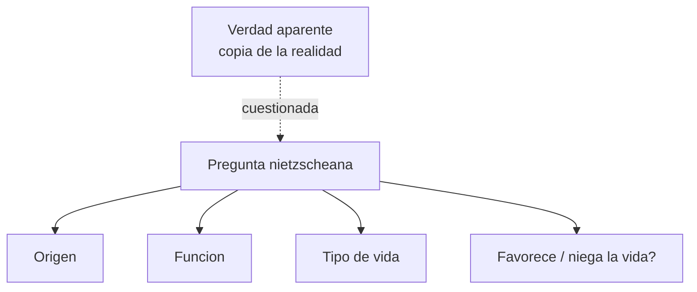


---

### 2. La crítica al modelo tradicional de conocimiento

El modelo tradicional funciona así:

```
realidad → pensamiento → lenguaje
```


| Paso del modelo | Lo que da por supuesto  |
| --------------- | ----------------------- |
| Realidad        | Es el fundamento último |
| Pensamiento     | Conoce la realidad      |
| Lenguaje        | Expresa lo pensado      |


Nietzsche **desconfía de esa secuencia**. El lenguaje no es un espejo: ordena, recorta, simplifica y deforma lo real desde una **perspectiva humana**.

> El conocimiento no es una representación pura del mundo: depende de nuestro **cuerpo, nuestra sensibilidad, nuestro lenguaje, nuestras necesidades y nuestra vida social**.

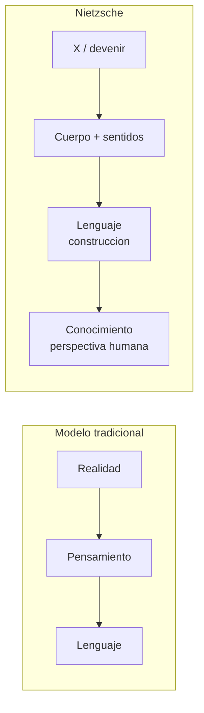


---

### 3. Verdad y mentira "en sentido extramoral"

El título no es un detalle: es fundamental. Nietzsche no estudia la verdad y la mentira en sentido **moral** (decir lo correcto frente a engañar). Lo que quiere es ir más atrás, a ver cómo se fabricó eso que llamamos verdad antes de juzgarlo bueno o malo.


| Sentido moral                 | Sentido extramoral                                    |
| ----------------------------- | ----------------------------------------------------- |
| ¿Está bien o está mal mentir? | ¿Qué es la verdad?                                    |
| Es un juicio ético            | ¿Cómo se **fabrica**?                                 |
|                               | ¿Por qué creemos que las palabras captan la realidad? |


La respuesta es que la verdad nace del **lenguaje**, y el lenguaje no refleja la realidad: la transforma en **signos útiles** para nosotros.

---

### 4. El lenguaje como metáfora

Entre la realidad y la palabra no hay una relación directa, sino una cadena de traducciones:

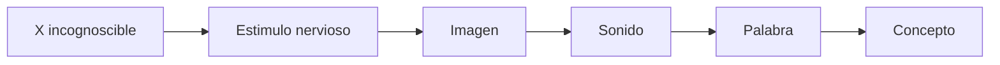


Cada paso es una **metáfora**, un traslado de un plano a otro. Y en cada traslado el lenguaje **traiciona** un poco lo real.

> La realidad en sí es una **X incognoscible**. Lo único que recibimos son estímulos, que después convertimos en imágenes, en sonidos y en palabras.

---

### 5. La realidad como devenir y como singularidad

En Nietzsche, lo real aparece de varias maneras: como una **X incognoscible**, como pura **singularidad** (cada cosa es única) y como **devenir** o flujo (movimiento, multiplicidad). La idea fuerte es que lo real no se deja atrapar del todo por conceptos fijos, mientras que el lenguaje justamente **fija, estabiliza y simplifica**.

El ejemplo del árbol lo deja claro:

- La palabra "árbol" es general.
- Pero ningún árbol concreto es idéntico a otro: cada uno tiene su forma, su historia, su textura, su posición.
- El concepto **borra esas diferencias** para poder meter muchas cosas distintas bajo una misma palabra.

> El concepto es **útil**, sí, pero al mismo tiempo **falsea**.

---

### 6. El concepto como olvido de las diferencias

Para Nietzsche, todo concepto nace de igualar cosas que no son iguales. El mecanismo es este:

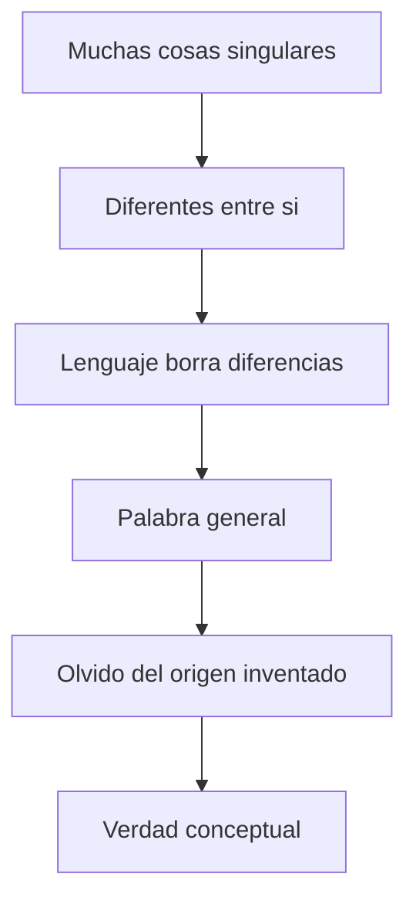


1. Hay muchas cosas singulares.
2. Son diferentes entre sí.
3. El lenguaje borra las diferencias.
4. Se forma una palabra general.
5. Nos olvidamos de que esa generalización fue **inventada**.

> Las verdades son **metáforas gastadas**, endurecidas por el uso. Primero fueron invenciones; después, de tanto repetirse, parecieron naturales.

Y de ahí surge la fórmula que conviene recordar:

> **La verdad es una ficción que se olvidó de que era ficción.**

---

### 7. Verdad, mentira y pacto social

La verdad también cumple una **función social**. Para convivir necesitamos un lenguaje común: nombres, significados y reglas compartidas.


| El que respeta el pacto           | El que lo rompe                  |
| --------------------------------- | -------------------------------- |
| Usa las palabras según las reglas | Se aparta de la ficción aceptada |
| Lo llamamos **veraz**             | Lo llamamos **mentiroso**        |


Pero, atención, para Nietzsche los dos usan **ficciones**. La diferencia no pasa por copiar o no copiar la realidad:

```
verdad  = la ficcion aceptada colectivamente
mentira = la ficcion que rompe el pacto comun
```

El lenguaje nos da **paz social**, pero la paga simplificando y **violentando** la singularidad de lo real.

---

### 8. El olvido como condición de la verdad

El olvido tiene un papel central, y conviene no pasarlo por alto. Para que una sociedad funcione, sus miembros tienen que **olvidar**:

- que las palabras son metáforas,
- que los conceptos son simplificaciones,
- y que las verdades son convenciones.

Si tuviéramos eso presente todo el tiempo, el mundo común se volvería inestable.


| El olvido como falla           | El olvido en Nietzsche                                                             |
| ------------------------------ | ---------------------------------------------------------------------------------- |
| Sería un error o una debilidad | Es una **condición de posibilidad** de la vida social, del lenguaje y de la verdad |


> La verdad necesita olvido: olvido de la diferencia, del origen metafórico y del pacto.

---

### 9. Ciencia, abstracción y arte

Nietzsche no critica a la ciencia de manera gratuita. La ciencia es **útil**: ordena la realidad con conceptos, leyes y clasificaciones, y gracias a eso podemos calcular, prever y organizar.

El problema aparece cuando la ciencia se cree que sus conceptos captan la **realidad en sí**, es decir, cuando **se olvida** de que trabaja con ficciones útiles.

Frente a eso, el arte tiene un lugar privilegiado: el artista crea metáforas e imágenes **sabiendo** que las crea. No confunde su ficción con una verdad absoluta.


|             | Científico / dogmático | Artista                           |
| ----------- | ---------------------- | --------------------------------- |
| Su ficción  | La olvida              | La **asume**                      |
| La verdad   | Cree que capta lo real | Sabe que interpreta               |
| La paradoja | —                      | Está **más cerca** de la "verdad" |


> **Solo se puede decir la verdad mintiendo.**

Que quede claro: no es una defensa del engaño moral. Es que toda verdad humana tiene algo de invención, de metáfora y de interpretación, y el arte es superior porque **asume** ese carácter creador en lugar de taparlo.

---

### 10. El equilibrio entre abstracción e intuición

Nietzsche **no** propone tirar la ciencia ni los conceptos por la ventana. De hecho, reconoce que no se puede vivir solo en la intuición ni solo en la abstracción.


| La abstracción aporta             | La intuición aporta                                               |
| --------------------------------- | ----------------------------------------------------------------- |
| Orden, estabilidad y comunicación | Creatividad, vitalidad y contacto con la multiplicidad de lo real |


El problema es uno solo: cuando la abstracción **domina** del todo y se olvida de su origen metafórico, la vida se empobrece y queda congelada en conceptos.

---

### 11. "Cómo el mundo verdadero acabó convirtiéndose en una fábula"

Este texto es de *Crepúsculo de los ídolos* (1888) y es una breve historia de la filosofía occidental. Pero no es una historia neutral: es la historia de un **error**. ¿Cuál? Haber inventado un **"mundo verdadero"** superior al mundo sensible.

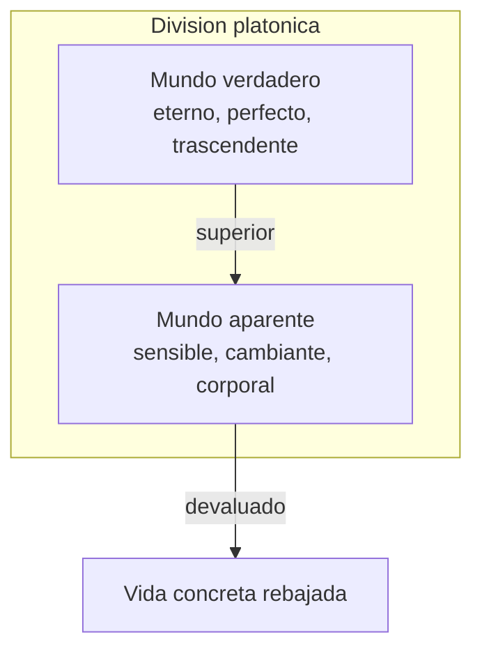


Nietzsche critica esta división porque **desvaloriza la vida**: el mundo sensible, que es el mundo donde efectivamente vivimos, queda rebajado a mera apariencia.

---

### 12. Theós: los fundamentos absolutos

A lo largo de la historia, el "mundo verdadero" se cambia el nombre, pero mantiene la **misma función**:

```
Idea → Dios → cosa en si → deber moral → imperativo categorico → verdad absoluta
```

De ahí la noción de **Theós**. Viene del griego "dios", pero acá no se refiere solo al Dios religioso: designa **cualquier fundamento absoluto** que se coloca por encima de la vida y pretende darle sentido **desde afuera**.

> Son máscaras distintas del **mismo error**.

---

### 13. Las seis etapas del error

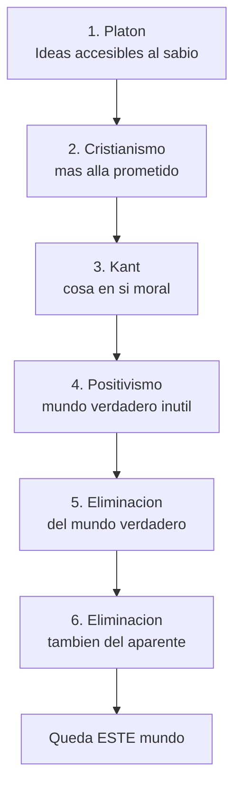


#### 1. Platón

El mundo verdadero es el de las **Ideas** (eternas y universales), accesible al sabio, al piadoso y al virtuoso. El mundo sensible queda como algo cambiante e inferior. Acá **se inaugura el gran error**.

#### 2. Cristianismo

El mundo verdadero pasa a ser **Dios, el Reino de los Cielos, la vida eterna**. Ahora es inalcanzable **por ahora**, pero prometido al creyente. El cristianismo profundiza el platonismo: este mundo queda todavía más devaluado.

#### 3. Kant

Solo conocemos **fenómenos**, no la cosa en sí. Pero Dios, el alma y el deber se mantienen en el plano **moral**. Kant no elimina el mundo verdadero: lo vuelve **más sutil** (el deber, el imperativo categórico).

#### 4. Positivismo

Rechaza la metafísica y se queda con los hechos verificables. Si el mundo verdadero no se puede conocer, entonces **ya no consuela ni obliga** y va perdiendo fuerza.

#### 5. La eliminación del mundo verdadero

Si es inútil, superfluo e indemostrable, hay que **eliminarlo**. Es la consumación de la crítica a la metafísica.

#### 6. La eliminación también del mundo aparente

Este es el punto más importante, conviene leerlo con atención:

> *"Hemos eliminado el mundo verdadero. ¿Qué mundo queda? ¿El aparente? No. Al eliminar el verdadero, eliminamos también el aparente."*

¿Por qué? Porque algo solo puede llamarse "aparente" si se lo compara con algo "verdadero". Si ya no hay un mundo verdadero superior, entonces **este mundo deja de ser apariencia**. Lo que queda es el **devenir, el cuerpo, la vida, la multiplicidad, la interpretación**.

Ojo con esto: Nietzsche **no invierte** el platonismo (no dice "lo sensible es lo verdadero", porque eso seguiría usando la oposición). Lo que hace es **destruir la oposición misma** entre verdadero y aparente.

---

### 14. El nihilismo

No significa, simplemente, "creer en la nada".

> El **nihilismo** es que los valores supremos **pierden su valor**: es la falta de respuesta al **"¿para qué?"**.

La Idea, Dios, la verdad absoluta, el deber moral... dejan de convencer.


| Etapa        | Cómo niega la vida                           |
| ------------ | -------------------------------------------- |
| Platón       | Pone el valor máximo **afuera** de esta vida |
| Cristianismo | Promete otra vida más verdadera              |
| Kant         | Lo conserva como moral trascendente          |


Un detalle clave: para Nietzsche el nihilismo **no empieza** con la muerte de Dios, sino mucho antes, con **Platón**.

---

### 15. La verdad como error útil o error inútil

Conviene no leer a Nietzsche como si dijera "todo da igual": no es un relativismo simplista. Sí sostiene que toda verdad es interpretación, ficción, perspectiva, y que en ese sentido toda verdad es un "error" (ninguna copia la realidad en sí). Pero distingue:


| Tipo             | Cómo es                                                  | Ejemplo                                                |
| ---------------- | -------------------------------------------------------- | ------------------------------------------------------ |
| **Error útil**   | Sirve para vivir, crear y afirmar la vida; es provisorio | Una interpretación que fortalece la vida               |
| **Error inútil** | Niega la vida                                            | El mundo verdadero, el más allá, la moral trascendente |


La pregunta central, entonces, no es si una verdad es absoluta, sino si **favorece o empobrece la vida**.

---

### 16. Filosofía crítica y filosofía afirmativa

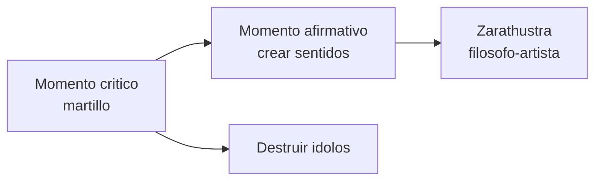


Hay un **momento crítico** y un **momento afirmativo**.

El crítico es el de *Crepúsculo de los ídolos*: filosofar "con el martillo", golpear la Idea, Dios, el mundo verdadero, el deber absoluto, para mostrar que están **huecos**.

El afirmativo viene después: una vez destruidos los viejos fundamentos, no queda la nada, sino la tarea de **crear nuevos sentidos**. Ahí aparece Zarathustra, la figura del filósofo-artista, del espíritu libre y creador de valores. La nueva filosofía no busca fundamentos eternos: crea interpretaciones **conscientes** de que son provisorias.

---

### 17. La relación entre los dos textos


|                  | *Sobre verdad y mentira*               | *Mundo verdadero... fábula*                           |
| ---------------- | -------------------------------------- | ----------------------------------------------------- |
| **En qué plano** | Lenguaje, metáfora, convención, olvido | Historia de la metafísica occidental                  |
| **Qué muestra**  | Cómo nace la verdad                    | Cómo las ficciones se volvieron fundamentos absolutos |


La fórmula que une a los dos es la misma:

> **La verdad es una ficción que se olvidó de que era ficción.**

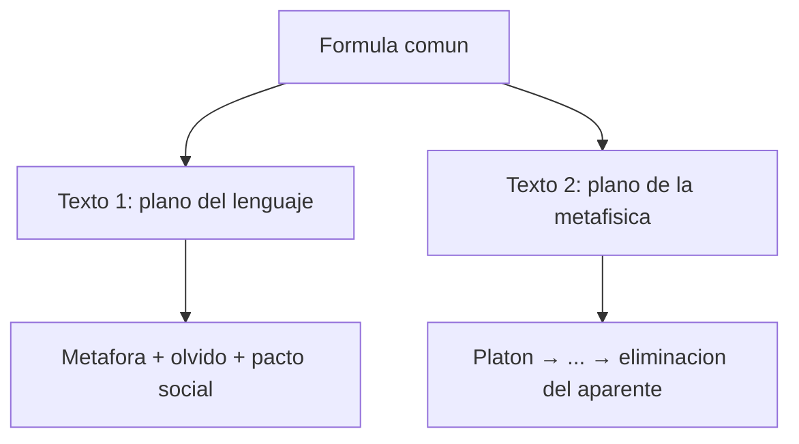


---

### 18. Síntesis Nietzsche (para el examen)

#### Mapa conceptual

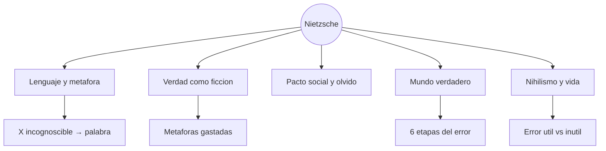


#### Glosario rápido


| Concepto                | Definición                                                       |
| ----------------------- | ---------------------------------------------------------------- |
| **Extramoral**          | El análisis de la verdad antes de juzgarla moralmente            |
| **X incognoscible**     | La realidad en sí, a la que no accedemos directamente            |
| **Metáfora**            | El traslado entre planos (estímulo → imagen → sonido → concepto) |
| **Concepto**            | Igualar lo desigual y olvidar las diferencias                    |
| **Olvido**              | La condición de la verdad y del orden social                     |
| **Theós**               | Cualquier fundamento absoluto colocado sobre la vida             |
| **Mundo verdadero**     | La ficción metafísica que desvaloriza este mundo                 |
| **Nihilismo**           | La pérdida de sentido de los valores supremos                    |
| **Error útil / inútil** | El criterio: ¿afirma o niega la vida?                            |


#### Ideas centrales para recordar

1. La verdad **no es una copia** objetiva de la realidad.
2. El lenguaje **construye** signos útiles, y cada paso es una metáfora.
3. Los conceptos **borran las diferencias** singulares.
4. La verdad y la mentira sociales son ficciones aceptadas frente a ficciones que rompen el pacto.
5. El **olvido** es lo que hace posible la verdad de todos los días.
6. La ciencia es útil; el **error** llega cuando olvida que es ficción. El arte es **superior** porque asume que crea.
7. Occidente inventó un **mundo verdadero** (de Platón a Kant, pasando por el positivismo).
8. Al eliminarlo, cae también el "aparente": queda **este mundo**.
9. El nihilismo es la crisis del "¿para qué?", y no empieza con la muerte de Dios.
10. La tarea es **crear sentidos provisorios** que afirmen la vida.

#### Fórmula breve para repasar

> Para Nietzsche, la verdad no es una copia objetiva de la realidad, sino una **construcción lingüística, social e histórica**. El lenguaje transforma estímulos en palabras y conceptos, pero en el camino **simplifica y deforma** lo real. Los conceptos igualan cosas diferentes y funcionan gracias al **olvido** de su origen metafórico: las verdades son **ficciones útiles** que se volvieron obligatorias por costumbre.
>
> Y la filosofía occidental convirtió esas ficciones en **fundamentos absolutos**. Desde Platón hasta Kant inventó un "mundo verdadero" superior y, al hacerlo, **desvalorizó la vida**. Ese mundo terminó siendo inútil y hay que eliminarlo; pero al eliminarlo desaparece también el "aparente". Queda **este mundo**: el del devenir, la vida y la interpretación. La tarea ya no es descubrir verdades eternas, sino **crear sentidos provisorios** que afirmen la vida.

---

## Parte IV: Sartre — El existencialismo es un humanismo

**De dónde sale:** de *El existencialismo es un humanismo* (1946), puntualmente de las **pp. 21–40**, donde Sartre defiende al existencialismo de sus críticos y presenta su tesis central: **la existencia precede a la esencia**.

---

### 1. El punto de partida: Sartre se defiende

Sartre comienza respondiendo a varios reproches. Las críticas le llegan de dos frentes.

```mermaid
flowchart TB
    S[Sartre responde]
    S --> M[Marxistas / comunistas]
    S --> C[Cristianos]
    M --> M1[Quietismo: inaccion]
    M --> M2[Filosofia contemplativa y burguesa]
    C --> C1[Sin Dios no hay criterios morales]
    C --> C2[Cada uno puede hacer cualquier cosa]
    S --> R[Respuesta: libertad + accion + responsabilidad]
```


| Quién critica      | Qué le reprocha                                                         | Qué responde Sartre                                              |
| ------------------ | ----------------------------------------------------------------------- | ---------------------------------------------------------------- |
| **Los marxistas**  | Quietismo: si no hay soluciones garantizadas, no tendría sentido actuar | El existencialismo **hace posible** la vida humana               |
| **Los cristianos** | Sin Dios ni valores eternos, no habría manera de condenar nada          | Pone al ser humano frente a su libertad y su **responsabilidad** |


> El existencialismo no destruye la vida humana: justamente la hace posible.

---

### 2. El existencialismo no es pesimismo

Se lo acusa de mirar solo el lado feo de la vida: lo sórdido, lo turbio, lo viscoso. Por eso algunos lo emparentan con un **naturalismo oscuro**. Pero Sartre **da vuelta la acusación**.


| La "sabiduría popular" resignada                    | El existencialismo                                         |
| --------------------------------------------------- | ---------------------------------------------------------- |
| "No hay que luchar contra los poderes establecidos" | El ser humano **puede elegir y actuar**                    |
| "No hay que ir contra la fuerza"                    | Es exigente y **optimista**                                |
| "No hay que pretender salir de la propia condición" | Lo que molesta es que **deja una posibilidad de elección** |


> Al final, lo que de verdad incomoda no es el pesimismo del existencialismo, sino su **optimismo**.

---

### 3. Una definición: dos tipos de existencialismo

En su época, "existencialismo" se había vuelto una **moda**: se les decía existencialistas a músicos, pintores y escritores sin saber bien qué significaba. Por eso Sartre busca precisar.


| Tipo                            | Ejemplos                | En qué se diferencian               |
| ------------------------------- | ----------------------- | ----------------------------------- |
| **Existencialistas cristianos** | Jaspers, Gabriel Marcel | Dios existe                         |
| **Existencialistas ateos**      | Heidegger, Sartre       | Dios no existe (o no viene al caso) |


Pero los dos comparten una misma tesis:

> **La existencia precede a la esencia.**

Esa es la **fórmula central** de todo el texto.

---

### 4. Qué quiere decir "la existencia precede a la esencia"

Sartre lo explica con el ejemplo del **abrecartas**, un objeto fabricado.

```mermaid
flowchart LR
    C[Concepto previo<br/>funcion + tecnica] --> F[Fabricacion]
    F --> E[Existencia del objeto]
```


| En los objetos técnicos                  | El orden es                                       |
| ---------------------------------------- | ------------------------------------------------- |
| Un abrecartas, un libro, una herramienta | La **esencia precede** a la existencia            |
|                                          | Primero está la idea; después, el objeto concreto |


```
concepto previo → fabricacion → existencia
```

El objeto existe porque **antes** alguien definió su esencia, es decir, qué es y para qué sirve.

---

### 5. Dios como artesano y la naturaleza humana

Cuando uno piensa en un **Dios creador**, suele imaginarlo como un **artesano superior**:

```
Dios tiene la idea de "hombre" → crea individuos como casos de ese concepto universal
```

Lo interesante es que en el **siglo XVIII** muchos filósofos prescinden de Dios, pero **conservan algo parecido**: la idea de una **naturaleza humana universal** (Kant, Voltaire, Diderot). Aunque ya no haya Dios, siguen creyendo que existe una esencia humana previa que define lo que el hombre es.

**Sartre lo rechaza.** Para el existencialismo **ateo**, si Dios no existe, **no hay ningún modelo previo** de ser humano: no hay esencia pensada antes de nuestra existencia.

---

### 6. El ser humano empieza por existir

De ahí sale la consecuencia central:

> El ser humano **no nace** con una esencia ya definida.

1. Primero **existe**: aparece en el mundo, se encuentra arrojado en una situación.
2. Recién **después** se define, mediante sus actos, sus elecciones y sus proyectos.

> *"El hombre no es otra cosa que lo que él se hace."*

No hay naturaleza humana porque no hay un Dios que la haya concebido de antemano. El ser humano **no viene terminado**: se **construye** a sí mismo viviendo.

```mermaid
flowchart LR
    subgraph trad ["Tradicion (esencia primero)"]
        ES1[Esencia / naturaleza] --> EX1[Existencia]
    end
    subgraph sartre ["Existencialismo ateo"]
        EX2[Existencia] --> ES2[Esencia / definicion]
    end
```


---

### 7. El ser humano como proyecto

El ser humano no es una cosa fija, como una piedra o una mesa: es un ser que se **proyecta hacia el futuro**.


| Una cosa                              | El ser humano                                             |
| ------------------------------------- | --------------------------------------------------------- |
| Es fija                               | Se **va haciendo**                                        |
| Una esencia cerrada que después actúa | Sus acciones, elecciones y proyectos **definen** quién es |


> La existencia humana es un **movimiento hacia adelante**: primero se existe y después uno se define por lo que hace con esa existencia.

---

### 8. Subjetividad no quiere decir capricho

A Sartre le reprochan partir de la **subjetividad**, así que aclara que la palabra tiene dos sentidos.


| Sentido superficial                | Sentido profundo                                               |
| ---------------------------------- | -------------------------------------------------------------- |
| Una elección individual caprichosa | El ser humano **no puede salirse** de la condición humana      |
| Cada uno elige solo para sí mismo  | Toda verdad y toda acción implican una **subjetividad humana** |


No es que cada uno pueda hacer cualquier cosa sin consecuencias. Todo lo contrario: como el ser humano **se elige**, se vuelve **responsable** de lo que hace.

---

### 9. La responsabilidad total

Si no hay esencia previa, entonces uno es **responsable** de lo que llega a ser.

> El primer paso del existencialismo es poner al ser humano en posesión de lo que es y hacer recaer sobre él la **responsabilidad total** de su existencia.

Y esa responsabilidad **no es solo individual**. Cuando elijo qué tipo de persona quiero ser, estoy proponiendo, de paso, una **imagen de lo que creo que el ser humano debe ser**.

> **Ejemplo:** si me resigno ante una injusticia, no estoy diciendo apenas "yo me resigno"; estoy afirmando que la **resignación** es una conducta válida para cualquiera.

Por eso Sartre lo resume así: **al elegirme, elijo al hombre**.

---

### 10. Toda elección compromete a la humanidad

No hay actos puramente privados: hasta la decisión más íntima expresa una idea de humanidad.


| La decisión                        | El compromiso que implica        |
| ---------------------------------- | -------------------------------- |
| Casarme, tener hijos               | Un modelo posible de vida humana |
| Afiliarme a un sindicato cristiano | Una imagen del hombre resignado  |
| Irme a combatir                    | Una imagen del hombre que lucha  |


Cuando elijo algo, lo presento como **valioso**. Por eso cada uno es responsable de **sí mismo y de todos**.

---

### 11. La angustia

De esa responsabilidad nace la **angustia**. Y no es el miedo común a una cosa concreta.


| El miedo                    | La angustia                                                             |
| --------------------------- | ----------------------------------------------------------------------- |
| Es miedo a algo determinado | Es darse cuenta de que mi elección **compromete una imagen del hombre** |
| Una emoción accidental      | La conciencia de que no puedo escaparle al peso de mis decisiones       |


El que está angustiado se sabe una especie de **legislador**: decide para sí, pero al mismo tiempo propone valores para toda la humanidad.

> La angustia está **pegada a la responsabilidad**, no es algo aparte.

```mermaid
flowchart LR
    E[Eleccion libre] --> R[Responsabilidad total]
    R --> A[Angustia]
    A --> AC[Accion consciente<br/>no paralisis]
```


---

### 12. Angustia y mala fe

Mucha gente **niega** su angustia: hace como si sus actos no importaran demasiado o solo la afectaran a ella.

> *"No importa si yo miento, total no todo el mundo hace lo mismo."*

Para Sartre, esa salida es **mala fe**. La pregunta correcta sería: ¿qué pasaría si **todo el mundo** hiciera lo mismo? Porque si yo miento, estoy admitiendo en mi acción que mentir puede ser válido, y entonces mi acto tiene un **alcance universal**.


| Mala fe                                 | Autenticidad                                                |
| --------------------------------------- | ----------------------------------------------------------- |
| Esconderse de la propia responsabilidad | Asumir que cada elección compromete una imagen de humanidad |
| Fingir que el acto es solo privado      | Preguntarse de verdad: ¿y si todos hicieran lo mismo?       |


---

### 13. El ejemplo de Abraham

Sartre retoma el ejemplo de Abraham, que viene de Kierkegaard: un ángel le ordena sacrificar a su hijo. Pero a Sartre le interesa el problema de la **interpretación**: ¿cómo sabe Abraham que es realmente un ángel? ¿Que la orden viene de Dios y no de su imaginación o de un estado patológico?

> Si una voz me habla, **soy yo** el que decide que esa voz es la de un ángel.

No hay ninguna prueba definitiva. Incluso quien dice obedecer una señal divina tiene que **interpretarla**, y esa interpretación ya es una **elección**. De la responsabilidad no hay escapatoria.

---

### 14. La angustia no lleva a la inacción

Importante para no malentender: la angustia **no** es quietismo. Forma parte de la **acción responsable**.

El ejemplo es el de un jefe militar que tiene que mandar soldados al combate:

- No puede esconderse detrás de órdenes abstractas ni de excusas.
- Tiene que **decidir**, y su decisión compromete vidas.
- Siente angustia **precisamente porque** sabe las consecuencias.

> La angustia no separa al ser humano de la acción: **es parte de la acción misma**.

---

### 15. El desamparo

Es una noción ligada a **Heidegger** (el "abandono").


| El desamparo significa                                             | El desamparo NO significa |
| ------------------------------------------------------------------ | ------------------------- |
| Que Dios no existe                                                 | Que "todo da igual"       |
| Que no hay valores dados de antemano en un cielo inteligible       | Caos moral                |
| Que no hay mandamientos eternos que garanticen nuestras elecciones | Inacción                  |


> El ser humano tiene que asumir que es **él mismo el que crea los valores** con sus actos.

Estamos solos, sin excusas.

```mermaid
flowchart TB
    D[Dios no existe] --> V[No hay valores a priori]
    V --> S[Solos, sin excusas]
    S --> C[Crear valores en la accion]
    C --> L[Libertad responsable]
```


---

### 16. La idea central del tramo (pp. 21–40)

El núcleo de estas páginas es que el existencialismo no es una filosofía de la desesperación pasiva, sino una filosofía de la **libertad y la responsabilidad**.


| La acusación  | La realidad sartreana     |
| ------------- | ------------------------- |
| Pesimismo     | Un **optimismo exigente** |
| Quietismo     | Acción consciente         |
| Caos sin Dios | Responsabilidad total     |


El ser humano no nace definido: primero existe y después se hace. Y como se hace **eligiendo**, es plenamente responsable de lo que es.

---

### 17. Síntesis Sartre (para el examen)

#### Mapa conceptual

```mermaid
flowchart TB
    S((Sartre pp. 21-40))
    S --> T[Existencia precede esencia]
    S --> L[Libertad y proyecto]
    S --> R[Responsabilidad]
    T --> T1[No naturaleza humana previa]
    L --> L1[El hombre se hace]
    R --> R1[Al elegirme elijo al hombre]
    R --> A[Angustia]
    R --> MF[Mala fe]
    R --> DES[Desamparo]
    A --> A1[Condicion de la accion]
```


#### Conceptos clave


| Concepto                         | Definición                                                     |
| -------------------------------- | -------------------------------------------------------------- |
| **Existencia precede a esencia** | Primero se existe; después uno se define por sus actos         |
| **Naturaleza humana**            | Sartre la rechaza: no hay una esencia universal previa         |
| **Proyecto**                     | El ser humano orientado al futuro; no es una cosa fija         |
| **Subjetividad**                 | La condición humana, no un capricho                            |
| **Responsabilidad**              | De uno y de todos; al elegir, propongo una imagen de humanidad |
| **Angustia**                     | La conciencia de que la elección compromete a lo humano        |
| **Mala fe**                      | Escaparse de la responsabilidad ("solo me afecta a mí")        |
| **Desamparo**                    | Sin Dios ni valores dados; hay que crear valores en la acción  |


#### Ideas centrales para recordar (pp. 21–40)

1. Sartre **defiende** al existencialismo de los marxistas y de los cristianos.
2. No es pesimismo, es **optimismo**: el ser humano puede elegir.
3. **La existencia precede a la esencia** es la fórmula central (vale para cristianos y ateos).
4. En los objetos, la esencia va primero; en el **ser humano ateo**, la existencia va primero.
5. Rechaza la idea de **naturaleza humana**, con Dios o sin Dios.
6. El ser humano es **proyecto**: "no es otra cosa que lo que se hace".
7. **Al elegirme, elijo al hombre**: toda elección tiene alcance universal.
8. La **angustia** es la del legislador moral involuntario, y no paraliza.
9. La **mala fe** es negar el alcance universal del propio acto.
10. **Abraham**: interpretar la voz ya es elegir.
11. El **desamparo** es quedarse sin excusas; hay que crear valores, no es caos.

#### Fórmula breve para repasar

> Para Sartre, el existencialismo sostiene que **la existencia precede a la esencia**: el ser humano no nace con una naturaleza fija, sino que primero existe y después se define mediante sus actos. Como no hay Dios, no hay un modelo previo de humanidad ni valores eternos que indiquen qué hacer. Pero eso no lleva al caos ni a la inacción, sino a la **responsabilidad**: cada uno, al elegirse, elige también una imagen del hombre. De ahí salen la **angustia** y el **desamparo**, que no son excusas para no actuar, sino señales de que toda acción humana es libre, comprometida y responsable.

---

## Parte V: Simone de Beauvoir — El segundo sexo

**De dónde sale:** de la **Introducción** de *El segundo sexo* (pp. 47–64), donde Beauvoir plantea la pregunta que ordena todo el libro —¿qué es una mujer?—, critica la idea de una esencia femenina natural y muestra que la mujer fue construida históricamente como **Alteridad**, es decir, como "lo Otro" frente al varón.

---

### 1. El punto de partida: ¿qué es una mujer?

Beauvoir empieza reconociendo que escribir sobre "la mujer" es **incómodo**. El feminismo parece un tema ya discutido, hasta agotado, pero el problema sigue abierto: todavía no está claro qué lugar ocupan las mujeres ni qué significa exactamente "ser mujer". La pregunta que ordena el libro es esta:

> ¿Qué es una mujer?

Y descarta de entrada dos respuestas demasiado fáciles.


| Respuesta simplista | En qué consiste                                                          | Por qué no alcanza                               |
| ------------------- | ------------------------------------------------------------------------ | ------------------------------------------------ |
| **Biologicista**    | La mujer es una hembra humana: una matriz, un cuerpo con útero y ovarios | La biología existe, pero **no basta**            |
| **Eterno femenino** | Habría una esencia femenina misteriosa, permanente y universal           | Convierte una situación histórica en una esencia |


> Ninguna de las dos explica qué significa, **social, histórica y existencialmente**, ser mujer.

---

### 2. La crítica al "eterno femenino"

La idea del **eterno femenino** sostiene que hay una esencia propia de "la Mujer": una feminidad natural, eterna, delicada, maternal, pasiva o misteriosa.

Beauvoir la critica porque presenta como **natural** algo que en realidad fue **producido** por relaciones sociales, culturales y políticas. Las ciencias modernas, dice, ya no creen en entidades fijas como "la mujer", "el negro" o "el judío" entendidos como caracteres eternos: los caracteres se **forman como respuesta a una situación**.

Y acá aparece la palabra clave de toda la Introducción:

> **Situación.** La mujer no se explica por una esencia, sino por la posición histórica y social que ocupa.

---

### 3. La crítica al nominalismo abstracto

Pero Beauvoir tampoco compra la posición contraria: la que dice que "mujer" es apenas una palabra arbitraria y que lo único importante es que todos somos seres humanos.


| Parece      | El problema                                                     |
| ----------- | --------------------------------------------------------------- |
| Igualitaria | **Tapa** las diferencias concretas de situación                 |
| Universal   | Una mujer no puede, de buena fe, situarse "más allá de su sexo" |


La diferencia sexual **existe socialmente**: se nota en el cuerpo, la ropa, los gestos, las ocupaciones, las expectativas y las oportunidades. Por eso Beauvoir rechaza los dos extremos:

```
NO al esencialismo (la esencia femenina eterna)
NO al universalismo abstracto (negar que las mujeres existen como grupo situado)
```

> La pregunta correcta no es "¿cuál es la esencia de la mujer?", sino: ¿cómo fue **situada** la mujer en el mundo?

---

### 4. El varón como norma y la mujer como diferencia


| El varón                              | La mujer                                  |
| ------------------------------------- | ----------------------------------------- |
| No necesita definirse como varón      | Aparece **marcada** por su sexo           |
| Se presenta sin más como "ser humano" | "Usted piensa eso **porque es mujer**"    |
| Es lo universal, lo humano en general | Es lo particular, lo sexuado, lo limitado |


> La humanidad se pensó a sí misma como **masculina**.

```mermaid
flowchart LR
    H[Hombre] --> S[Sujeto / Absoluto / Esencial]
    M[Mujer] --> O[Otro / Alteridad / Inesencial]
    S -->|norma| N[Medida de lo humano]
    O -->|relativa a| S
```


El varón aparece como **Sujeto, Absoluto, Esencial**; la mujer, como **lo Otro, Alteridad, lo Inesencial**. Esta es una de las tesis centrales del texto.

---

### 5. La mujer como "lo Otro"

Beauvoir toma la categoría de **lo Otro** (la Alteridad) para explicar la situación de la mujer. Todo grupo humano tiende a definirse como "Uno" frente a un "Otro".


| Conflicto            | Cómo es la alteridad                         |
| -------------------- | -------------------------------------------- |
| Extranjero / nativo  | **Recíproca**: cada uno es Otro para el otro |
| Proletario / burgués | Puede **invertirse** (aparece un "nosotros") |
| **Mujer / varón**    | Un **Otro absoluto**, sin reciprocidad plena |


Con casi todos los grupos esa alteridad termina siendo recíproca, o se rebela. Con las mujeres pasa algo distinto: el varón se afirma como sujeto y define a la mujer como alteridad, pero la mujer **no logra** históricamente dar vuelta la relación y afirmarse, en conjunto, como sujeto.

---

### 6. ¿Por qué las mujeres no se constituyen como un "nosotras"?

Beauvoir se pregunta por qué las mujeres no cuestionaron de raíz la soberanía masculina. Su respuesta es que **no forman una minoría separada** ni un grupo con una historia autónoma: viven **dispersas** entre los varones.

A diferencia de otros grupos oprimidos, las mujeres no tienen:

- un territorio propio,
- una historia separada,
- una religión propia,
- una solidaridad de clase común,
- una comunidad espacial equivalente a un gueto, una fábrica o una colonia.

> Una mujer burguesa suele estar más unida a su marido burgués que a una mujer proletaria; una mujer blanca, más vinculada a los varones blancos que a las mujeres negras.

Por eso les cuesta tanto decir "nosotras", y muchas veces terminan adoptando las palabras con que los varones las nombran: "las mujeres".

---

### 7. La relación con el varón es única

La opresión de las mujeres no se parece del todo a ninguna otra.


| Otras opresiones              | La situación de género                          |
| ----------------------------- | ----------------------------------------------- |
| Proletariado contra burguesía | La lucha es posible                             |
| Colonizado contra colonizador | La rebelión es posible                          |
| Mujeres y varones             | **No pueden ni quieren eliminar** a los varones |


La división sexual atraviesa la vida humana desde adentro: sexualidad, reproducción, familia, convivencia, deseo, amor. Por eso Beauvoir dice que la mujer es **la Alteridad en el corazón de una totalidad**: está subordinada al varón, pero a la vez ligada a él por vínculos afectivos, económicos, sexuales, familiares y sociales.

---

### 8. La dependencia no libera

Uno podría pensar que, como los varones necesitan a las mujeres —por el deseo, la reproducción, la familia—, eso les daría poder. Beauvoir lo descarta.


| La analogía                  | Lo que muestra                               |
| ---------------------------- | -------------------------------------------- |
| El amo necesita al esclavo   | Y, sin embargo, eso no libera al esclavo     |
| El varón necesita a la mujer | Esa necesidad **no impide** la subordinación |


La necesidad del amo no se reconoce como dependencia: el amo tiene poder para organizarla a su favor. La mujer, en cambio, **interioriza** su dependencia: necesita protección, reconocimiento, seguridad económica y justificación social.

---

### 9. La complicidad de la mujer con su alteridad

Beauvoir no dice que las mujeres sean apenas víctimas pasivas. Señala algo más incómodo: muchas veces ellas también **se acomodan** en la posición de Otro.

¿Por qué? Porque afirmarse como sujeto implica riesgos: libertad, responsabilidad, incertidumbre, trabajo, independencia. Aceptar el lugar de Otro, en cambio, puede ofrecer ciertas ventajas:

- la protección masculina,
- la seguridad material,
- el reconocimiento social,
- y la evasión de la angustia de tener que inventar los propios fines.

Acá se ve la **influencia existencialista**: todo sujeto quiere afirmarse como libertad, pero también puede intentar escaparle a esa libertad convirtiéndose en cosa, en objeto, en ser dependiente. Es un camino **alienante**, pero tentador, porque evita el peso de una existencia asumida de verdad.

---

### 10. La supremacía masculina se presentó como natural

¿Cómo empezó todo esto? Beauvoir no da una respuesta cerrada, pero sí muestra algo decisivo: los varones justificaron su dominio presentándolo como **natural, eterno y legítimo**.

Como fueron ellos los legisladores, los sacerdotes, los filósofos y los escritores, pudieron convertir **sus propios intereses** en principios universales. De ahí la frase que cita, de Poulain de la Barre:

> *"Todo lo que los hombres han escrito sobre las mujeres es sospechoso, porque son juez y parte."*

La cultura masculina transformó su supremacía en derecho, moral, religión, ciencia y filosofía.

---

### 11. Religión, filosofía y ciencia como coartada

La subordinación femenina se justificó de mil maneras a lo largo del tiempo.


| Ámbito              | La coartada                                                                     |
| ------------------- | ------------------------------------------------------------------------------- |
| **Religión**        | Eva, Pandora: el pecado, la caída, la tentación                                 |
| **Filosofía**       | Aristóteles ve a la mujer como deficiente; Santo Tomás, como un "varón fallido" |
| **Derecho**         | Se invoca su supuesta fragilidad o incapacidad para recortarle derechos         |
| **Ciencia moderna** | Biología, psicología y medicina al servicio de una "inferioridad natural"       |


El mecanismo es siempre el mismo: se toma una situación **producida socialmente** y se la disfraza de **inferioridad natural**.

---

### 12. El círculo vicioso de la opresión

```mermaid
flowchart LR
    A[1. Colocar al grupo en inferioridad] --> B[2. Observar inferioridad en la practica]
    B --> C[3. Usarla como prueba de que merece subordinacion]
    C --> A
```


Primero se pone a un grupo en situación de inferioridad; después se observa que ese grupo es, en los hechos, inferior; y por último se usa esa inferioridad como prueba de que merece seguir subordinado.

> **El ejemplo de Bernard Shaw:** se relega a los negros a limpiar zapatos y después se concluye que "solo sirven para limpiar zapatos".

La clave está en distinguir dos sentidos de "ser":


| Sentido sustancial (rechazado)      | Sentido dinámico (el de Beauvoir)                                         |
| ----------------------------------- | ------------------------------------------------------------------------- |
| "Son inferiores **por naturaleza**" | "Han **llegado a ser** inferiores por la situación en que fueron puestas" |


La pregunta, entonces, no es si esa inferioridad existe de hecho, sino si **debe perpetuarse**.

---

### 13. La trampa de la "igualdad en la diferencia"

Beauvoir critica la fórmula **"igualdad dentro de la diferencia"**.


| Parece      | En la práctica                                                                     |
| ----------- | ---------------------------------------------------------------------------------- |
| Justa       | Sirve para mantener la desigualdad                                                 |
| Igualitaria | Funciona como las fórmulas segregacionistas: igualdad… pero "cada uno en su lugar" |


No se trata de negar toda diferencia entre varones y mujeres, sino de **rechazar** que esas diferencias justifiquen la **subordinación**.

---

### 14. Lo que los varones ganan con la opresión

Beauvoir también analiza por qué muchos varones quieren conservar esta situación. No son solo intereses económicos, aunque existen: ocupan mejores puestos, ganan más y tienen más oportunidades.

También hay **beneficios simbólicos**. Incluso el varón más mediocre puede sentirse **superior** frente a las mujeres.

> Es una compensación imaginaria: aunque no sea poderoso frente a otros varones, siempre puede sentirse "más" que una mujer.

Por eso algunos defienden con tanta insistencia la alteridad femenina: no quieren perder el privilegio de ser el Sujeto absoluto.

---

### 15. La mala fe masculina

Beauvoir muestra que muchos varones sostienen posiciones contradictorias según les convenga.


| Cuando les conviene                                           | Cuando hay conflicto                                                 |
| ------------------------------------------------------------- | -------------------------------------------------------------------- |
| "Las mujeres **ya son iguales**, no tienen nada que reclamar" | "Nunca van a poder ser iguales, porque la diferencia es **natural**" |


Usan la igualdad abstracta cuando les sirve y la desigualdad concreta cuando quieren conservar privilegios. Además, muchos no pueden medir el peso real de las discriminaciones, simplemente porque **no las viven desde adentro**. De ahí que Beauvoir desconfíe tanto de los ataques contra las mujeres como de los elogios interesados a la "mujer mujer".

---

### 16. Crítica también a ciertos argumentos feministas

Beauvoir no acepta sin más todos los argumentos feministas. Dice que la polémica entre antifeministas y feministas muchas veces quedó **estéril**, atrapada en preguntas mal planteadas:

```
¿La mujer es superior al hombre? ¿Es inferior? ¿Es igual?
```

Para ella, esos términos —superioridad, inferioridad, igualdad— suelen deformar el problema.

> La cuestión no hay que plantearla en abstracto, sino desde la **situación concreta** de las mujeres y desde sus **posibilidades reales de libertad**.

---

### 17. ¿Quién puede hablar sobre la mujer?


| Posición        | El problema                                     |
| --------------- | ----------------------------------------------- |
| **Los varones** | Son juez y parte; se benefician de la situación |
| **Las mujeres** | También están implicadas                        |


Aun así, Beauvoir cree que algunas mujeres de su tiempo están bien ubicadas para analizar el problema: accedieron a ciertos privilegios humanos, pueden tomar distancia de la lucha inmediata y, a la vez, conocen el mundo femenino desde adentro porque tienen sus raíces en él.

> No se trata de hablar desde una neutralidad imposible, sino desde una **lucidez situada**.

---

### 18. El punto de vista existencialista

Hacia el final del tramo, Beauvoir explicita el criterio filosófico desde el que va a analizar todo: la **moral existencialista** (la influencia de Sartre es evidente).

Desde esa perspectiva, todo sujeto humano tiende a afirmarse como **libertad y trascendencia**: no está hecho para quedar encerrado en una identidad fija, sino para proyectarse, actuar, crear y superar lo dado.


| Cuando la trascendencia cae en inmanencia | Cómo se evalúa                |
| ----------------------------------------- | ----------------------------- |
| Si el propio sujeto la acepta             | Hay **falta moral** (mala fe) |
| Si se la imponen desde afuera             | Hay **opresión**              |


---

### 19. Trascendencia e inmanencia

Estos dos conceptos son la columna vertebral del análisis.

```mermaid
flowchart LR
    subgraph T [Trascendencia]
        T1[Proyectarse]
        T2[Crear fines]
        T3[Libertad]
    end
    subgraph I [Inmanencia]
        I1[Lo dado]
        I2[Repeticion / pasividad]
        I3[Funcion fija / destino]
    end
    T <-->|drama de la mujer| I
```


| Concepto          | Qué significa                                                                                                   |
| ----------------- | --------------------------------------------------------------------------------------------------------------- |
| **Trascendencia** | Proyectarse más allá de lo dado: actuar, crear futuro, afirmarse como libertad                                  |
| **Inmanencia**    | Quedar encerrado en lo dado: la repetición, la pasividad, el mundo doméstico o biológico entendido como destino |


La mujer es una **libertad**, como todo ser humano, pero la sociedad la empuja a ser **objeto**, a la inmanencia.

---

### 20. El drama central de la mujer

> La mujer es, como todo ser humano, una **libertad autónoma**. Pero se descubre en un mundo donde los varones le imponen ser **lo Otro**.

Su trascendencia queda negada o subordinada por otra conciencia que se presenta como **esencial y soberana**: la masculina.

```mermaid
flowchart TB
    L[Exigencia: afirmarse como sujeto] --> D[Drama / conflicto]
    S[Situacion: ser lo Otro / inesencial] --> D
    D --> O[Opresion + complicidad posible]
```


El drama, entonces, es el conflicto entre su **exigencia de afirmarse como sujeto** y una **situación social que la convierte en inesencial**. Este es el centro filosófico de todo el tramo.

---

### 21. La pregunta no es por la felicidad, sino por la libertad

Beauvoir se niega a evaluar la situación de la mujer en términos de felicidad. No sirve preguntar:

```
¿Es mas feliz una mujer encerrada en un haren que una mujer libre?
¿Es mas feliz un ama de casa que una obrera?
```

La felicidad ajena no se mide fácilmente y, encima, suele usarse como **excusa** para justificar la opresión: se declara feliz a alguien precisamente para mantenerlo quieto. Por eso el criterio no va a ser la felicidad, sino la **libertad**.

> La pregunta correcta es: ¿qué posibilidades concretas tiene una mujer de realizarse como libertad?

---

### 22. El programa del libro

Al final de la Introducción, Beauvoir anuncia el método general de la obra.

```mermaid
flowchart TD
    P1[1. Critica de reducciones<br/>biologia, psicoanalisis, materialismo]
    P1 --> P2[2. Historia: como se constituyo<br/>la realidad femenina como Alteridad]
    P2 --> P3[3. Mundo ofrecido a las mujeres<br/>y dificultades para salir de la esfera asignada]
```


Primero va a discutir las explicaciones que intentan reducir a la mujer a un destino (la biología, el psicoanálisis, el materialismo histórico). Después va a mostrar cómo se constituyó históricamente la "realidad femenina" como Alteridad. Y, por último, va a describir, desde el punto de vista de las mujeres, el mundo que se les ofrece y las dificultades que enfrentan cuando intentan salir de la esfera que les fue asignada.

---

### 23. Síntesis Beauvoir (para el examen)

#### Mapa conceptual

```mermaid
flowchart TB
    B((Beauvoir pp. 47-64))
    B --> Q[Que es una mujer?]
    B --> S[Situacion no esencia]
    B --> A[Alteridad / Otro]
    B --> E[Existencialismo]
    Q --> Q1[No biologicismo ni eterno femenino]
    S --> S1[Circulo vicioso de opresion]
    A --> A1[Hombre = Sujeto; mujer = Otro]
    E --> E1[Trascendencia vs inmanencia]
    E --> E2[Libertad, no felicidad]
```


#### Glosario rápido


| Concepto             | Definición                                                              |
| -------------------- | ----------------------------------------------------------------------- |
| **Eterno femenino**  | La idea de una esencia femenina natural y eterna (que Beauvoir rechaza) |
| **Situación**        | La posición histórica y social; es la categoría central                 |
| **Sujeto**           | El que se afirma como libertad, centro de sentido y proyecto            |
| **Alteridad / Otro** | El lugar en el que se coloca a la mujer frente al varón-Sujeto          |
| **Inesencial**       | Lo secundario, lo relativo, lo definido en función del varón            |
| **Trascendencia**    | Superar lo dado y proyectar fines                                       |
| **Inmanencia**       | El encierro en lo dado, la pasividad, la función impuesta               |
| **Opresión**         | Una libertad reducida a objeto por otra conciencia dominante            |
| **Mala fe**          | Presentar como natural algo que es histórico y producido                |


#### Ideas centrales para recordar (pp. 47–64)

1. La pregunta central es **¿qué es una mujer?**
2. Ni biologicismo ni **eterno femenino**; tampoco nominalismo abstracto.
3. La clave es la **situación**, no una esencia.
4. El varón es la norma universal; la mujer queda **marcada**, particular.
5. La mujer es un **Otro absoluto**, sin reciprocidad plena.
6. Les cuesta constituirse como "nosotras": están dispersas y cruzadas por clase y raza.
7. Son la Alteridad **en el corazón de una totalidad** (vínculo necesario con los varones).
8. La dependencia recíproca **no libera**.
9. Hay **complicidad** posible con la alteridad (el escape existencialista de la libertad).
10. La supremacía se presentó como natural; los varones son **juez y parte**.
11. La opresión funciona como un **círculo vicioso**.
12. Critica la "igualdad en la diferencia", la mala fe masculina y el feminismo estéril.
13. El drama es la **trascendencia** contra la **inmanencia** impuesta.
14. El criterio es la **libertad**, no la felicidad.

#### Fórmula breve para repasar

> Para Simone de Beauvoir, la mujer no se define por una esencia natural ni por el "eterno femenino", sino por una **situación histórica y social**. El varón se colocó como Sujeto, Absoluto y medida de lo humano, mientras que la mujer quedó definida como **lo Otro**, lo inesencial. Esa alteridad no es solo biológica: fue producida y justificada por la religión, la filosofía, la ley, la ciencia y las costumbres. La opresión opera como un **círculo vicioso**: se limita a las mujeres, se constata su inferioridad y se usa esa inferioridad como prueba de que deben seguir subordinadas. Desde la moral existencialista, el criterio no es la felicidad sino la **libertad**: la mujer es trascendencia, pero la sociedad la empuja a la inmanencia. El drama es querer afirmarse como sujeto en un mundo que la obliga a asumirse como Alteridad.

---

## Parte VI: Síntesis comparativa del parcial

### Mapa de los cuatro autores

```mermaid
flowchart TB
    subgraph hegel [Hegel]
        H1[Saber y ser en un proceso]
        H2[Experiencia de la conciencia]
        H3[Saber absoluto = saber del saber]
    end
    subgraph nietzsche [Nietzsche]
        N1[Lenguaje = metafora y ficcion]
        N2[Mundo verdadero = error]
        N3[Crear sentidos que afirmen la vida]
    end
    subgraph sartre [Sartre]
        S1[Existencia precede esencia]
        S2[Al elegirme elijo al hombre]
        S3[Angustia y desamparo]
    end
    subgraph beauvoir [Beauvoir]
        B1[Situacion no esencia]
        B2[Mujer como Otro]
        B3[Libertad no felicidad]
    end
    sartre -->|moral existencialista| beauvoir
    hegel -->|supera sujeto aislado| sartre
    nietzsche -->|critica verdad objetiva| hegel
```


### Tabla comparativa rápida


| Tema                       | Hegel                                       | Nietzsche                                | Sartre                                | Beauvoir                                       |
| -------------------------- | ------------------------------------------- | ---------------------------------------- | ------------------------------------- | ---------------------------------------------- |
| **El sujeto**              | Inmerso en el ser; una conciencia colectiva | Una perspectiva humana atada al lenguaje | Un proyecto libre que elige al hombre | La mujer como Otro / inesencial                |
| **La verdad / el sentido** | Un proceso dialéctico                       | Una ficción útil ya olvidada             | Algo que se crea en la acción         | Una situación histórica, no una esencia        |
| **La crítica central**     | A la representación sujeto-objeto           | Al mundo verdadero metafísico            | A la naturaleza humana previa         | Al eterno femenino y al nominalismo abstracto  |
| **La libertad**            | El saber absoluto retrospectivo             | Afirmar la vida                          | La responsabilidad total              | La trascendencia contra la inmanencia impuesta |
| **El criterio ético**      | La totalidad del proceso                    | El error útil frente al inútil           | La angustia sin quietismo             | La **libertad**, no la felicidad               |


### Frases clave para el parcial (los cuatro autores)

**Hegel**

1. *"El Espíritu solo conquista su verdad en el absoluto desgarramiento."*
2. Conocer no es representar objetos: es una **experiencia** que transforma a la conciencia y al objeto.
3. El saber absoluto es comprender el **camino completo** del saber (un saber del saber).
4. La conciencia progresa **perdiendo certezas**.

**Nietzsche**

1. *"La verdad es una ficción que se olvidó de que era ficción."*
2. La verdad es la ficción aceptada colectivamente; la mentira, la que rompe el pacto.
3. Al eliminar el mundo verdadero, eliminamos también el "aparente".
4. La pregunta clave: ¿esta verdad **afirma o niega la vida**?

**Sartre (pp. 21–40)**

1. *"La existencia precede a la esencia."*
2. *"El hombre no es otra cosa que lo que él se hace."*
3. *"Al elegirme, elijo al hombre."*
4. La angustia y el desamparo son responsabilidad, **no** quietismo.
5. La mala fe: *"total, no todo el mundo hace lo mismo."*

**Beauvoir (pp. 47–64)**

1. *"¿Qué es una mujer?"* — ni biología ni eterno femenino: **situación**.
2. El varón es Sujeto/Esencial; la mujer, **Otro/Inesencial**.
3. El **círculo vicioso**: limitar, después constatar la inferioridad y por último justificar la subordinación.
4. Poulain de la Barre: los varones son **juez y parte**.
5. El criterio es la **libertad**, no la felicidad; el drama es trascendencia contra inmanencia.

### Ultra-resumen final (todo el parcial)

**Hegel** repiensa el conocimiento desde el ser: la conciencia, inmersa en él, atraviesa experiencias dialécticas, va perdiendo certezas parciales y avanza hacia un saber absoluto que integra el recorrido completo, con sus errores, crisis y superaciones.

**Nietzsche** muestra que la verdad es una construcción lingüística y social (metáfora, concepto, olvido, pacto). Critica la metafísica occidental del "mundo verdadero" —de Platón a Kant— y propone quedarnos con este mundo, el del devenir, creando sentidos provisorios que afirmen la vida.

**Sartre** (pp. 21–40) defiende al existencialismo de las acusaciones de quietismo y pesimismo. La existencia precede a la esencia: no hay una naturaleza humana previa, el ser humano se hace eligiendo. Y al elegirse elige una imagen del hombre; de ahí la angustia y el desamparo, que son expresión de una libertad responsable y no de inacción.

**Beauvoir** (pp. 47–64) pregunta qué es una mujer y rechaza tanto la esencia biológica como el eterno femenino. La mujer fue situada como Alteridad frente al varón-Sujeto; la opresión opera en círculo vicioso y se disfraza de naturaleza. Desde el existencialismo, el criterio es la libertad (la trascendencia), no la felicidad: el drama es afirmarse como sujeto en un mundo que impone la inmanencia.